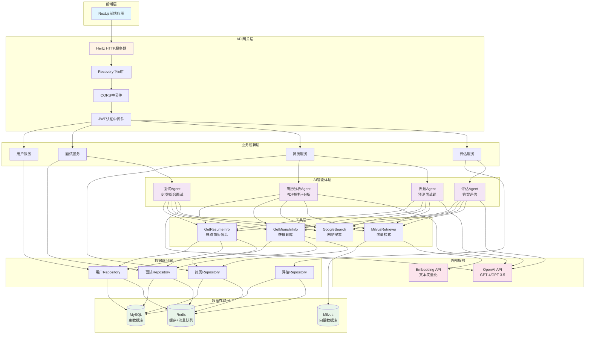
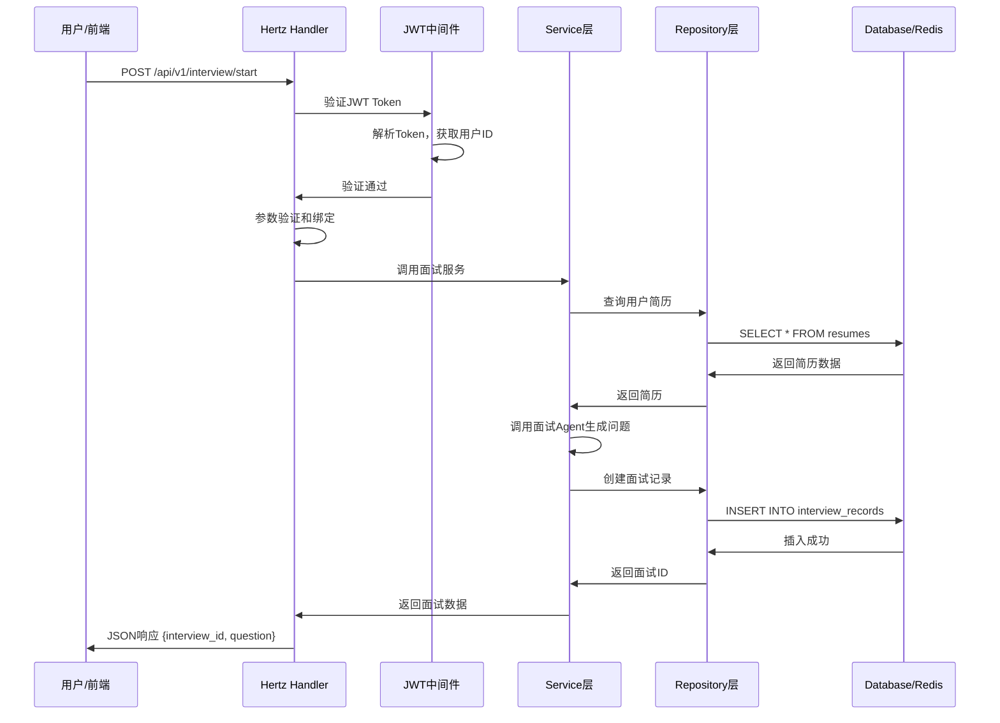
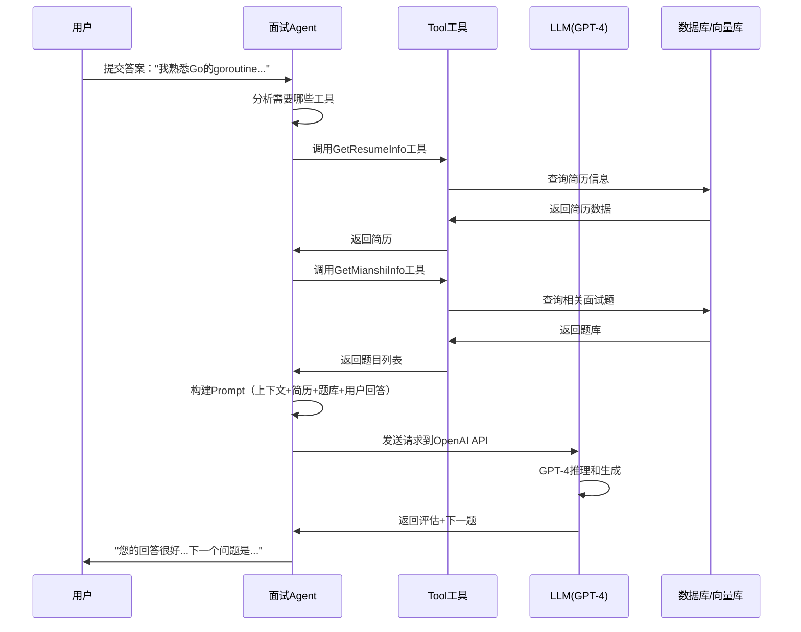
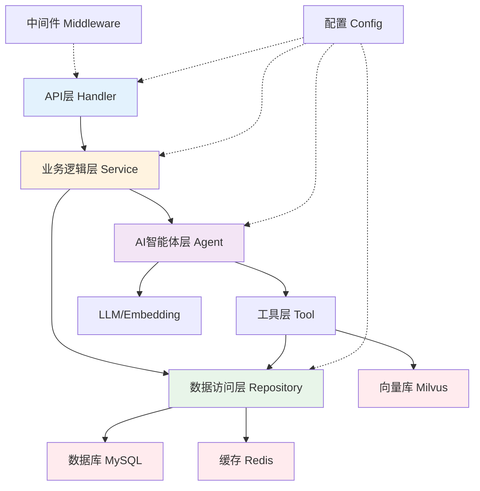

# 第一阶段：架构理解

> 目标：建立系统整体认知，理解架构设计和技术选型

## 📚 本阶段学习内容

1. [系统架构总览](#系统架构总览)
2. [技术栈详解](tech-stack.md)
3. [启动流程分析](startup-flow.md)
4. [配置管理](config-management.md)

---

## 系统架构总览

### 核心功能模块

记录你理解的系统核心功能：

1. **用户管理模块**
   - 功能: 用户注册、登录、微信登录、用户信息管理
   - 技术实现: Hertz Handler + JWT认证 + MySQL存储

2. **简历管理模块**
   - 功能: 简历上传、PDF解析、智能分析、简历押题
   - 技术实现: PDF解析工具 + 简历分析智能体 + MySQL存储

3. **面试系统模块**
   - 功能: 综合面试、专项面试、AI驱动的问题生成、智能答案评估
   - 技术实现: 面试智能体 + 评估智能体 + Redis消息队列

4. **AI智能体模块**
   - 功能: 基于Eino框架的多智能体系统（面试、简历分析、评估、预测）
   - 技术实现: Eino框架 + OpenAI GPT + Tool工具调用 + Milvus向量检索(可选)

### 系统架构图



### 分层架构

记录系统的分层架构：

```
├── API层 (Handler)
│   职责: 接收HTTP请求，参数验证，调用Service层，返回响应
│   特点: 轻量级，不包含业务逻辑，只负责请求转发和响应格式化
│   示例: interview/handler.go - 处理面试相关的HTTP请求
│   
├── 业务逻辑层 (Service)
│   职责: 实现核心业务逻辑，编排多个Repository调用，处理事务
│   特点: 包含业务规则、权限检查、数据转换、调用AI智能体
│   示例: interview/service.go - 面试流程控制、问题生成、评估逻辑
│   
├── 数据访问层 (Repository)
│   职责: 封装数据库操作，提供CRUD接口，管理数据库连接
│   特点: 隔离数据库细节，使用GORM进行ORM映射，处理Redis缓存
│   示例: repository/interview.go - 面试记录的增删改查
│   
└── 数据模型层 (Model)
    职责: 定义数据结构，对应数据库表，定义数据关系
    特点: 使用GORM标签定义表结构，包含字段验证规则
    示例: model/interview/interview.go - InterviewRecord结构体
```

**分层原则**:
- ✅ 上层可以调用下层，下层不能调用上层
- ✅ 同层之间尽量避免直接调用
- ✅ 每层职责单一，便于测试和维护
- ✅ 通过接口解耦，方便替换实现

---

## 技术栈分析

### 后端技术栈

| 技术 | 作用 | 选型原因 |
|------|------|---------|
| Hertz | Web框架 | 字节跳动开源，性能比Gin高40%，支持HTTP2，代码生成工具完善 |
| Eino | AI框架 | Go原生AI框架，类型安全，性能高，与LangChain相比更适合Go项目 |
| MySQL | 数据库 | 成熟稳定，ACID事务支持，生态丰富，适合结构化数据存储 |
| Redis | 缓存+消息队列 | 高性能，数据结构丰富，支持Pub/Sub，用于缓存、会话、消息队列 |
| GORM | ORM | Go最流行的ORM，自动迁移，关联查询，钩子函数，开发效率高 |
| JWT | 认证 | 无状态认证，不需要服务器端存储，支持跨域，易于扩展 |

### AI相关技术

| 技术 | 作用 | 说明 |
|------|------|------|
| OpenAI API | 大语言模型 | 使用GPT-4/GPT-3.5-turbo进行对话生成、问题生成、答案评估 |
| Milvus | 向量数据库 | 可选组件，存储和检索文本向量，实现语义搜索，支持简历匹配 |
| Embedding | 文本向量化 | 使用text-embedding-ada-002将文本转为1536维向量，用于相似度计算 |

---

## 项目目录结构

记录你对目录结构的理解：

```
backend/
├── main.go              # 作用: 程序入口，初始化配置、数据库、Redis、消息队列，启动HTTP服务
├── config.yaml          # 作用: 系统配置文件，包含数据库、Redis、OpenAI等所有配置
├── api/                 # 作用: HTTP API层，处理外部请求
│   ├── handler/         # 作用: HTTP请求处理器，接收请求、参数验证、调用Service
│   ├── router/          # 作用: 路由注册，定义URL到Handler的映射关系
│   └── response/        # 作用: 统一响应格式，封装成功/失败响应结构
├── internal/            # 作用: 内部包，不对外暴露的核心逻辑
│   ├── config/          # 作用: 配置加载和管理，解析config.yaml，环境变量展开
│   ├── model/           # 作用: 数据模型定义，对应数据库表结构（User、Interview等）
│   ├── repository/      # 作用: 数据访问层，封装数据库和Redis操作
│   ├── service/         # 作用: 业务逻辑层，实现核心业务规则（如果需要独立Service）
│   └── middleware/      # 作用: 中间件，JWT认证、CORS、日志、错误处理等
└── chatApp/             # 作用: AI智能体应用模块，基于Eino框架
    ├── agent/           # 作用: 智能体实现（面试、简历分析、押题、评估Agent）
    ├── agent_service/   # 作用: 智能体服务封装，提供统一的Agent调用接口
    └── tool/            # 作用: 工具实现（简历获取、题库获取、搜索、向量检索）
```

---

## 核心概念

### 1. Hertz框架
记录你对Hertz的理解：
- **什么是Hertz？**
  - 字节跳动开源的高性能Go HTTP框架
  - 基于自研的Netpoll网络库，性能比Gin高40%
  - 支持HTTP/1.1、HTTP/2、HTTPS协议
  
- **为什么选择Hertz？**
  - **高性能**: QPS高，延迟低，适合高并发场景
  - **易用性**: API设计友好，与Gin类似，学习成本低
  - **企业级**: 字节跳动内部大规模使用，稳定性有保障
  - **生态**: 与Eino等字节系工具无缝集成
  - **代码生成**: 通过IDL自动生成路由代码
  
- **Hertz的特点？**
  - 中间件机制：Recovery、CORS、JWT等
  - 参数绑定：自动解析JSON、表单、URL参数
  - 路由管理：支持路由组、参数路由、静态路由
  - 优雅关闭：支持处理完现有请求后再退出

### 2. Eino框架
记录你对Eino的理解：
- **什么是Eino？**
  - 字节跳动开源的Go语言LLM应用开发框架
  - 提供Agent（智能体）、Tool（工具）、Chain（链）、Flow（流）等核心组件
  - 类似Python的LangChain，但性能更高、类型更安全
  
- **Eino的核心概念？**
  - **Agent（智能体）**: 具备自主决策能力的AI实体，能调用工具、维护对话上下文
  - **Tool（工具）**: Agent可调用的外部能力（数据库查询、API调用、搜索等）
  - **Chain（链）**: 多个组件按顺序串联的执行流程
  - **Flow（流）**: 支持条件分支和并行执行的复杂流程
  - **Memory（记忆）**: 维护对话历史和上下文
  
- **如何使用Eino？**
  ```go
  // 1. 创建工具
  tool, _ := utils.InferTool("tool_name", "description", function)
  
  // 2. 创建Agent
  agent := agent.NewAgent(chatModel, tools, memory)
  
  // 3. 调用Agent
  response, _ := agent.Generate(ctx, userInput)
  ```

### 3. 智能体（Agent）
- **什么是智能体？**
  - 具备自主决策能力的AI程序
  - 能够理解任务目标、调用工具、执行操作、返回结果
  - 维护对话上下文，实现多轮对话
  - 可以进行Chain-of-Thought（思维链）推理
  
- **系统中有哪些智能体？**
  1. **面试Agent** (`chatApp/agent/interview/`)
     - 专项面试：Go、Java、MySQL、Redis等技术面试
     - 综合面试：校招/社招综合能力面试
  2. **简历分析Agent** (`chatApp/agent/resume/`)
     - PDF解析：提取简历文本内容
     - 信息提取：结构化简历数据（教育、工作、技能）
  3. **押题Agent** (`chatApp/agent/prediction/`)
     - 根据简历预测可能的面试题
     - 分析技术栈和经验，生成针对性问题
  4. **评估Agent** (`chatApp/agent/record_evaluation/`)
     - 评估候选人的面试表现
     - 生成评估报告（技术能力、沟通能力、综合评分）
  
- **智能体如何工作？**
  ```
  用户输入 → Agent接收
       ↓
  理解意图，制定计划
       ↓
  调用工具获取信息（简历、题库、搜索）
       ↓
  调用LLM生成回答
       ↓
  返回结果给用户
  ```
  
  **工作流程示例（面试Agent）**：
  1. 接收用户回答
  2. 调用评估工具分析回答质量
  3. 从题库中选择下一个问题
  4. 调用GPT-4生成面试官的反馈和新问题
  5. 返回给前端显示

---

## 数据流分析

### 典型请求流程

画出一个典型API请求的处理流程：



**详细步骤说明**：
1. **前端发起请求**: POST /api/v1/interview/start，携带JWT Token
2. **中间件验证**: JWT中间件验证Token有效性，提取用户ID
3. **Handler层**: 接收请求，验证参数（面试类型、难度等）
4. **Service层**: 
   - 调用Repository查询用户简历
   - 调用面试Agent生成第一个问题
   - 创建面试记录到数据库
5. **Repository层**: 执行数据库CRUD操作
6. **返回响应**: 层层返回，最终Handler返回JSON响应

### AI处理流程

画出AI智能体的处理流程：



**AI处理详细流程**：
1. **接收用户输入**: Agent收到用户的回答内容
2. **工具调用阶段**:
   - 调用`GetResumeInfo`获取用户简历信息
   - 调用`GetMianshiInfo`从题库获取相关题目
   - （可选）调用`MilvusRetriever`进行向量检索
   - （可选）调用`GoogleSearch`补充最新信息
3. **上下文构建**: 整合对话历史、简历、题库、当前回答
4. **LLM推理**: 
   - 将上下文发送给GPT-4
   - GPT-4分析回答质量、生成评价
   - 决定下一个问题或结束面试
5. **返回结果**: Agent返回评估反馈和新问题

---

## 依赖关系

### 外部依赖

记录系统的外部依赖：

1. **数据库**: MySQL 8.0
   - **用途**: 存储用户数据、面试记录、对话历史、评估结果、简历信息
   - **连接配置**: 
     ```yaml
     database:
       host: mysql
       port: 3306
       username: root
       password: root
       database: interview_db
       max_open_conns: 100
       max_idle_conns: 10
       conn_max_lifetime: 3600s
     ```
   - **环境变量**: `${DATABASE_DSN}` 或单独配置各项

2. **缓存**: Redis 7
   - **用途**: 
     - 用户信息缓存（减少数据库查询）
     - 会话管理（用户登录状态）
     - 消息队列（异步评估报告生成）
     - 分布式锁（防止并发创建面试）
     - API限流计数
   - **连接配置**: 
     ```yaml
     redis:
       addr: redis:6379
       password: root
       db: 0
       dial_timeout: 5s
       pool_size: 10
     ```
   - **环境变量**: `${REDIS_ADDR}`, `${REDIS_PASSWORD}`

3. **AI服务**: OpenAI
   - **用途**: 
     - GPT-4/GPT-3.5-turbo: 对话生成、问题生成、答案评估
     - text-embedding-ada-002: 文本向量化（用于相似度搜索）
   - **API Key配置**: 
     ```yaml
     openai:
       api_key: ${OPENAI_API_KEY}
       base_url: https://api.openai.com/v1
       model: gpt-4
       max_tokens: 2000
       temperature: 0.7
     ```
   - **环境变量**: `OPENAI_API_KEY` (必需)
   - **成本控制**: 单次面试约$0.33，月1000次面试约¥2400

4. **向量数据库**: Milvus 2.4.2 (可选)
   - **用途**: 
     - 存储简历的向量表示
     - 语义相似度搜索（找到相似简历、相似问题）
     - 知识库检索（技术文档、历史面试记录）
   - **连接配置**: 
     ```yaml
     milvus:
       address: localhost:19530
       username: ""
       password: ""
       database: default
       collection_name: resumes
       dimensions: 1536
     ```
   - **为何可选**: 小规模应用可用MySQL关键词匹配替代，成本和部署复杂度较低
   - **何时启用**: 简历数量>1000或需要高精度语义搜索时

### 内部模块依赖

画出模块之间的依赖关系：



**依赖规则**:
- ✅ **上层依赖下层**: Handler → Service → Repository → Database
- ❌ **下层不依赖上层**: Database不能调用Service
- ✅ **同层解耦**: Service之间通过接口调用
- ✅ **配置统一注入**: 所有层都依赖Config，但Config不依赖其他层
- ✅ **中间件独立**: Middleware在Handler之前执行，不依赖具体业务

**依赖注入示例**:
```go
// main.go中初始化
db := repository.InitDatabase(config.Global.Database)
redis := repository.InitRedis(config.Global.Redis)
interviewService := service.NewInterviewService(db, redis)
interviewHandler := handler.NewInterviewHandler(interviewService)
```

---

## ❓ 问题记录

在学习过程中的疑问：

### Q1: _____
**我的理解**: _____  
**相关代码**: _____  
**解决状态**: [ ] 已解决 [ ] 待解决

---

## 💡 重要发现

记录学习过程中的重要发现：

1. _____
2. _____
3. _____

---

## ✅ 学习检查点

完成以下检查点，确认你已掌握本阶段内容：

- [ ] 能够画出系统整体架构图
- [ ] 理解各技术栈的作用和选型原因
- [ ] 了解项目目录结构和各目录的职责
- [ ] 理解Hertz和Eino框架的基本概念
- [ ] 能够说明一个API请求的完整处理流程
- [ ] 完成 [启动流程分析](startup-flow.md)
- [ ] 完成 [配置管理](config-management.md)
- [ ] 完成 [技术栈详解](tech-stack.md)

---

**下一步**: [启动流程分析](startup-flow.md)
