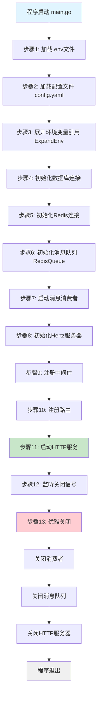

# 启动流程分析

> 分析系统从启动到就绪的完整流程

## 📋 学习任务

1. 阅读 [backend/main.go](../../backend/main.go) 完整代码
2. 理解每个初始化步骤的作用
3. 画出启动流程图
4. 记录关键代码片段

---

## 启动流程图



---

## 详细步骤分析

### 步骤1: 加载环境变量

**代码位置**: `backend/main.go:L30-36`

```go
// 1. 加载 .env 文件（如果存在）
if err := godotenv.Load(); err != nil {
    log.Printf("Warning: Could not load .env file: %v", err)
    log.Println("Application will use system environment variables or config.yaml defaults")
} else {
    log.Println("Successfully loaded .env file")
}
```

**作用**: 
- 使用 `godotenv` 库从 `.env` 文件加载环境变量
- 如果 `.env` 文件不存在，不会报错，而是发出警告
- 允许系统使用操作系统环境变量或配置文件的默认值

**加载逻辑**:
1. 优先从当前目录查找 `.env` 文件
2. 将文件中的键值对加载到进程环境变量中
3. 不会覆盖已存在的系统环境变量
4. 如果文件不存在，系统仍可正常运行

**最佳实践**:
- `.env` 文件用于本地开发环境
- 生产环境直接使用操作系统环境变量或Docker环境变量
- `.env` 文件应该被 `.gitignore` 忽略，避免提交敏感信息

---

### 步骤2: 加载配置文件

**代码位置**: `backend/main.go:L38-51`

```go
// 2. 加载配置文件
// 获取配置文件路径（相对于 main.go 所在目录）
configPath := findConfigFile()
cfg, err := config.LoadConfig(configPath)
if err != nil {
    log.Fatalf("Failed to load configuration: %v", err)
}

// 3. 展开配置中的环境变量引用（${VAR_NAME}）
cfg.ExpandEnv()
log.Println("Environment variables expanded in configuration")
```

**作用**: 
- 查找并加载 `config.yaml` 配置文件
- 解析YAML文件到Config结构体
- 展开配置中的环境变量引用（如 `${OPENAI_API_KEY}`）
- 如果加载失败，程序直接退出（`log.Fatalf`）

**配置文件路径查找逻辑** (findConfigFile函数):
```go
func findConfigFile() string {
    // 1. 获取 main.go 源代码文件的路径
    _, currentFile, _, ok := runtime.Caller(0)
    if !ok {
        return "config.yaml" // 降级方案
    }
    
    // 2. main.go 在 backend 目录下，config.yaml 也在 backend 目录下
    backendDir := filepath.Dir(currentFile)
    configPath := filepath.Join(backendDir, "config.yaml")
    
    // 3. 检查文件是否存在
    if _, err := os.Stat(configPath); err == nil {
        return configPath
    }
    
    // 4. 尝试从项目根目录运行的情况
    if wd, err := os.Getwd(); err == nil {
        path1 := filepath.Join(wd, "backend", "config.yaml")
        if _, err := os.Stat(path1); err == nil {
            return path1
        }
        path2 := filepath.Join(wd, "config.yaml")
        if _, err := os.Stat(path2); err == nil {
            return path2
        }
    }
    
    // 5. 默认返回相对路径
    return configPath
}
```

**查找优先级**:
1. backend/config.yaml（相对于main.go）
2. 项目根目录/backend/config.yaml
3. 当前工作目录/config.yaml

**环境变量展开**:
- `ExpandEnv()` 方法将配置中的 `${VAR_NAME}` 替换为实际环境变量值
- 例如：`${OPENAI_API_KEY}` → 实际的API密钥

---

### 步骤3: 初始化数据库

**代码位置**: `backend/main.go:L53-59`

```go
// 4. 初始化数据库
log.Println("Initializing database connection...")
err = repository.InitDatabase(cfg.Database)
if err != nil {
    log.Fatalf("Failed to initialize database: %v", err)
}
log.Println("Database initialized successfully")
```

**InitDatabase 实现** (`backend/internal/repository/database.go`):
```go
func InitDatabase(dbConfig config.DatabaseConfig) error {
    // 1. 配置GORM日志
    logLevel := logger.Info
    
    // 2. 连接数据库（使用GORM + MySQL驱动）
    db, err := gorm.Open(mysql.Open(dbConfig.DSN), &gorm.Config{
        Logger: logger.Default.LogMode(logLevel),
    })
    if err != nil {
        return err
    }
    
    // 3. 配置连接池
    sqlDB, err := db.DB()
    if err != nil {
        return err
    }
    
    sqlDB.SetMaxIdleConns(dbConfig.MaxIdleConns)
    sqlDB.SetMaxOpenConns(dbConfig.MaxOpenConns)
    if dbConfig.ConnMaxLifetime != "" {
        connMaxLifetime, err := time.ParseDuration(dbConfig.ConnMaxLifetime)
        if err == nil {
            sqlDB.SetConnMaxLifetime(connMaxLifetime)
        }
    }
    
    // 4. 设置全局DB实例
    DB = db
    model.SetDBGetter(GetDB)
    
    // 5. 自动迁移数据库表结构
    err = migrateDatabase()
    if err != nil {
        return err
    }
    
    return nil
}
```

**作用**: 
1. 建立与MySQL数据库的连接
2. 配置连接池参数，优化性能
3. 设置全局数据库实例供其他模块使用
4. 自动迁移数据库表结构（创建/更新表）

**连接池配置** (从config.yaml读取):
- **MaxOpenConns: 100** - 最大打开连接数，控制并发上限
- **MaxIdleConns: 10** - 最大空闲连接数，保持连接复用
- **ConnMaxLifetime: 1h** - 连接最大存活时间，避免长连接问题

**数据库迁移**:
自动迁移以下模型表：
- User（用户表）
- UserModel（用户模型偏好表）
- InterviewRecord（面试记录表）
- InterviewDialogue（面试对话表）
- InterviewEvaluation（面试评估表）
- AnswerReport（答案报告表）
- Resume（简历表）
- PredictionRecord（预测记录表）
- PredictionQuestion（预测问题表）

**失败处理**:
- 如果数据库连接失败，程序使用 `log.Fatalf` 直接退出
- 这是合理的，因为没有数据库系统无法正常工作

---

### 步骤4: 初始化Redis

**代码位置**: `backend/main.go:L61-67`

```go
//5. 初始化Redis
log.Println("Initializing Redis connection...")
err = repository.InitRedis(cfg.Redis)
if err != nil {
    log.Fatalf("Failed to initialize Redis: %v", err)
}
log.Println("Redis initialized successfully")
```

**InitRedis 实现** (`backend/internal/repository/redis.go`):
```go
func InitRedis(redisCfg config.RedisConfig) error {
    // 1. 创建Redis客户端
    RedisClient = redis.NewClient(&redis.Options{
        Addr:     redisCfg.Addr,     // Redis服务器地址
        Password: redisCfg.Password, // Redis密码
        DB:       redisCfg.DB,       // 数据库索引
    })
    
    // 2. 测试连接
    ctx := context.Background()
    _, err := RedisClient.Ping(ctx).Result()
    if err != nil {
        return err
    }
    
    log.Println("Redis连接成功")
    return nil
}
```

**作用**: 
- 建立与Redis服务器的连接
- 使用Ping命令测试连接是否正常
- 设置全局Redis客户端实例

**Redis在系统中的用途**:
1. **缓存管理**
   - 用户会话缓存（Session）
   - 热点数据缓存（减少数据库查询）
   - API响应缓存

2. **消息队列**
   - 使用Redis的Pub/Sub功能实现消息队列
   - 异步处理面试评估报告生成
   - 异步处理主题评估

3. **分布式锁**
   - 防止面试并发创建
   - 控制资源访问

4. **会话存储**
   - JWT Token的黑名单
   - 用户登录状态管理

**配置参数** (从config.yaml读取):
- Addr: redis:6379（Redis服务器地址）
- Password: root（认证密码）
- DB: 0（数据库索引，0-15）
- DialTimeout: 5s（连接超时）
- ReadTimeout: 3s（读取超时）
- WriteTimeout: 3s（写入超时）
- PoolSize: 10（连接池大小）
- MinIdleConns: 5（最小空闲连接）

**失败处理**:
- 如果Redis连接失败，程序直接退出
- Redis是系统的关键组件，用于消息队列和缓存

---

### 步骤5: 初始化消息队列

**代码位置**: `backend/main.go:L82-99`

```go
// 8. 初始化消息队列（使用 Redis）
log.Println("Initializing Redis message queue...")
redisClient := repository.GetRedis()
if redisClient == nil {
    log.Fatalf("Redis client not initialized")
}
messageQueue := mq.NewRedisQueue(redisClient)
mq.InitMessageQueue(messageQueue) // 设置全局消息队列
log.Println("Redis message queue initialized successfully")

// 9. 启动消费者
log.Println("Starting message consumer...")
consumerCtx, cancelConsumer := context.WithCancel(context.Background())
go func() {
    if err := mq.StartConsumer(consumerCtx); err != nil {
        log.Printf("Error starting consumer: %v", err)
    }
}()
// 给消费者一点时间启动
time.Sleep(500 * time.Millisecond)
defer cancelConsumer()
```

**作用**: 
1. **创建消息队列**: 基于Redis Pub/Sub机制创建消息队列
2. **初始化全局队列**: 设置全局消息队列实例，供其他模块使用
3. **启动消费者**: 在独立goroutine中启动消息消费者，监听消息
4. **异步处理**: 实现任务的异步处理，避免阻塞主流程

**消息队列架构**:
```
生产者（Producer）
    ↓
发布消息到Redis Channel
    ↓
Redis Pub/Sub
    ↓
消费者（Consumer）订阅Channel
    ↓
处理消息（异步执行任务）
```

**消息队列用途**: 
1. **异步评估报告生成**
   - 消息类型: `MessageTypeEvaluationReport`
   - 场景: 面试结束后，异步生成详细的评估报告
   - 好处: 不阻塞用户请求，提升响应速度

2. **主题评估**
   - 消息类型: `MessageTypeTopicEvaluation`
   - 场景: 对面试中的各个主题进行深度评估
   - 好处: 解耦评估逻辑，提高系统可扩展性

**消息结构**:
```go
type Message struct {
    Type    MessageType            `json:"type"`    // 消息类型
    Payload map[string]interface{} `json:"payload"` // 消息负载
}
```

**消费者处理流程**:
1. 订阅所有消息类型的Redis Channel
2. 接收消息并反序列化
3. 根据消息类型调用相应的处理器
4. 处理成功/失败记录日志
5. 如果失败，可以实现重试机制

**为什么使用Redis而不是Kafka**:
- Redis已经在系统中使用，减少依赖
- 对于中小规模应用，Redis Pub/Sub足够使用
- 部署简单，维护成本低
- 如果需要更强的可靠性和持久化，可以迁移到Kafka

**优雅关闭**:
- 使用 `cancelConsumer()` 通知消费者停止
- 消费者会处理完当前消息后退出
- 避免消息丢失

---

### 步骤6: 注册路由和中间件

**代码位置**: `backend/main.go:L101-138`

```go
// 初始化Hertz服务器
s := server.Default(server.WithHostPorts(fmt.Sprintf("%s:%d", cfg.Host, cfg.Port)))

// 1. 添加错误处理中间件（Recovery: 捕获panic）
s.Use(routerMiddleware.Recovery())

// 2. 添加全局CORS中间件，处理OPTIONS预检请求
s.Use(func(ctx context.Context, c *app.RequestContext) {
    // 设置CORS头
    c.Header("Access-Control-Allow-Origin", "*")
    c.Header("Access-Control-Allow-Methods", "GET, POST, PUT, DELETE, OPTIONS")
    c.Header("Access-Control-Allow-Headers", "Content-Type, Authorization, X-Requested-With, Cache-Control, X-Auth-Token")
    c.Header("Access-Control-Max-Age", "86400")
    
    // 如果是OPTIONS请求，直接返回204
    if string(c.Method()) == "OPTIONS" {
        log.Printf("[CORS] OPTIONS request: %s", c.Path())
        c.AbortWithStatus(204)
        return
    }
    
    c.Next(ctx)
})

// 3. 注册JWT中间件并配置白名单
s.Use(appMiddleware.JWTMiddlewareWithSkipper(interviewRouter.AuthSkipper()))

// 4. 注册路由
router.GeneratedRegister(s)
```

**路由注册流程**:
1. **创建Hertz服务器实例**: 配置监听地址和端口
2. **注册全局中间件**: 按照执行顺序注册
3. **注册路由组**: 调用GeneratedRegister注册所有路由
4. **路由组内部**: 各模块注册自己的路由和中间件

**中间件注册顺序** (很重要!):
- ✅ **Recovery中间件** (最先) - 捕获panic，防止服务崩溃
- ✅ **CORS中间件** - 处理跨域请求，允许前端访问
- ✅ **JWT认证中间件** - 验证用户身份（带白名单跳过机制）
- ✅ **路由处理器** (最后) - 执行具体的业务逻辑

**中间件执行流程**:
```
请求进入
    ↓
Recovery中间件 (捕获panic)
    ↓
CORS中间件 (处理跨域)
    ↓
JWT中间件 (验证token)
    ↓
路由处理器 (业务逻辑)
    ↓
响应返回
```

**CORS配置说明**:
- **Allow-Origin: *** - 允许所有域名访问（开发环境方便，生产环境应限制）
- **Allow-Methods** - 允许的HTTP方法
- **Allow-Headers** - 允许的请求头
- **Max-Age: 86400** - 预检请求缓存时间（24小时）
- **OPTIONS处理** - 直接返回204，不进入业务逻辑

**JWT白名单机制**:
```go
// 以下路由不需要JWT验证
func AuthSkipper() []string {
    return []string{
        "/api/v1/user/login",
        "/api/v1/user/register",
        "/api/v1/user/wechat/login",
        "/api/v1/health",
        // ... 其他公开路由
    }
}
```

**路由注册**:
```go
// router/register.go
func GeneratedRegister(r *server.Hertz) {
    interview.Register(r)  // 注册面试相关路由
    // 其他模块路由...
}
```

**为什么Recovery必须在最前面**:
- 如果后续中间件或处理器发生panic
- Recovery能够捕获并返回500错误
- 避免整个服务崩溃

---

### 步骤7: 启动HTTP服务

**代码位置**: `backend/main.go:L140-151`

```go
// 创建一个通道来监听中断信号
quit := make(chan os.Signal, 1)
signal.Notify(quit, syscall.SIGINT, syscall.SIGTERM)

// 在单独的goroutine中启动服务器
go func() {
    log.Printf("Server is running on %s:%d", cfg.Host, cfg.Port)
    if err := s.Run(); err != nil && !errors.Is(err, http.ErrServerClosed) {
        log.Fatalf("Failed to start server: %v", err)
    }
}()

// 等待中断信号
<-quit
log.Println("Shutting down server...")
```

**监听地址**: 
- Host: `0.0.0.0` (监听所有网络接口)
- Port: `8888` (从配置文件读取)
- 完整地址: `0.0.0.0:8888`

**服务启动流程**:
1. **创建信号通道**: 用于接收操作系统的关闭信号
2. **注册信号监听**: 监听 SIGINT (Ctrl+C) 和 SIGTERM (kill命令)
3. **启动HTTP服务**: 在独立goroutine中启动，避免阻塞主流程
4. **阻塞等待信号**: 主goroutine等待关闭信号
5. **接收信号后**: 进入优雅关闭流程

**Hertz服务器配置** (从config.yaml读取):
```yaml
hertz:
  log_level: info          # 日志级别
  log_path: ./logs         # 日志文件路径
  read_timeout: 10s        # 读取请求超时
  write_timeout: 10s       # 写入响应超时
  idle_timeout: 60s        # 空闲连接超时
```

**配置说明**:
- **ReadTimeout: 10s**
  - 读取完整请求的最大时间
  - 防止慢客户端攻击
  - 对于AI接口可能需要调整更长

- **WriteTimeout: 10s**
  - 写入完整响应的最大时间
  - AI流式响应可能需要更长时间
  
- **IdleTimeout: 60s**
  - Keep-Alive连接的最大空闲时间
  - 超时后关闭连接，释放资源

**为什么在goroutine中启动服务器**:
```go
// 如果直接调用 s.Run()
s.Run() // 这里会阻塞
// 下面的代码永远不会执行
<-quit

// 使用goroutine
go func() {
    s.Run() // 在后台运行
}()
<-quit // 主goroutine可以继续执行，等待信号
```

**错误处理**:
- 如果启动失败（端口被占用等），使用 `log.Fatalf` 退出
- 忽略 `http.ErrServerClosed` 错误（这是正常关闭产生的）

**监听的信号**:
- **SIGINT** - Ctrl+C 产生的中断信号
- **SIGTERM** - kill命令发送的终止信号
- Docker容器停止时也会发送SIGTERM

**启动日志**:
```
Server is running on 0.0.0.0:8888
```
此时服务已经可以接收HTTP请求

---

### 步骤8: 优雅关闭处理

**代码位置**: `backend/main.go:L153-184`

```go
// 等待中断信号
<-quit
log.Println("Shutting down server...")

// 1. 关闭消费者
cancelConsumer()
log.Println("Message consumer stopped")

// 2. 关闭消息队列
if err := messageQueue.Close(); err != nil {
    log.Printf("Warning: Failed to close message queue: %v", err)
}
log.Println("Message queue closed")

// 3. 关闭 Milvus Manager（如果启用）
// if milvusManager != nil {
//     if err := milvusManager.Close(); err != nil {
//         log.Printf("Warning: Failed to close Milvus Manager: %v", err)
//     }
// }

// 4. 创建一个带有超时的上下文，用于关闭
shutdownCtx, cancel := context.WithTimeout(context.Background(), 5*time.Second)
defer cancel()

// 5. 关闭HTTP服务器
if err := s.Shutdown(shutdownCtx); err != nil {
    log.Fatalf("Server forced to shutdown: %v", err)
}

log.Println("Server exiting")
```

**关闭信号**: 
- **SIGINT** (Ctrl+C) - 终端中断信号
- **SIGTERM** (kill命令) - 系统终止信号
- Docker容器停止时也会发送SIGTERM

**优雅关闭流程** (按顺序执行):

**1. 停止接收新请求** ← 接收到关闭信号时自动触发

**2. 关闭消息消费者**
   - 调用 `cancelConsumer()` 取消context
   - 消费者停止监听新消息
   - 处理完当前正在处理的消息
   - 避免消息丢失

**3. 关闭消息队列**
   - 关闭Redis Pub/Sub订阅
   - 释放Redis连接
   - 如果失败，记录警告但继续

**4. 关闭向量数据库** (当前被注释)
   - 关闭Milvus连接
   - 释放相关资源

**5. 关闭HTTP服务器** (重点)
   - 创建5秒超时的context
   - 停止接收新请求
   - 等待现有请求处理完成
   - 如果5秒内未完成，强制关闭

**6. 程序退出**
   - 打印退出日志
   - 返回到操作系统

**为什么需要优雅关闭**:

**场景1: 用户正在面试**
```
没有优雅关闭:
用户: "我的答案是..."
服务器: [突然关闭]
用户: ??? 数据丢失

有优雅关闭:
用户: "我的答案是..."
服务器: [等待处理完成] ✓
服务器: [保存数据后关闭]
用户: 数据安全保存
```

**场景2: 消息队列正在处理**
```
没有优雅关闭:
消息队列: [正在生成评估报告...]
服务器: [突然关闭]
结果: 报告丢失，用户看不到评估

有优雅关闭:
消息队列: [正在生成评估报告...]
服务器: [等待处理完成]
消息队列: [报告生成完成] ✓
服务器: [安全关闭]
```

**超时机制的作用**:
```go
shutdownCtx, cancel := context.WithTimeout(context.Background(), 5*time.Second)
```
- 给服务器5秒时间处理完现有请求
- 如果5秒内完成：优雅关闭成功
- 如果5秒后还未完成：强制关闭，避免无限等待
- 5秒是一个权衡值，可以根据业务调整

**关闭顺序很重要**:
1. 先停止消费者 → 不再接收新任务
2. 再关闭消息队列 → 释放消息资源
3. 最后关闭HTTP服务器 → 处理完现有请求
4. 反过来会导致数据丢失

**Docker环境的优雅关闭**:
```bash
# Docker stop 会先发送SIGTERM
docker stop backend
# 等待10秒（Docker默认）
# 如果还未退出，发送SIGKILL强制杀死
```

**最佳实践**:
- 关闭超时时间不要太短（避免数据丢失）
- 关闭超时时间不要太长（避免影响部署）
- 记录详细的关闭日志（方便排查问题）
- 对于非关键组件（如缓存），失败时只记录警告

---

## 初始化顺序分析

### 为什么是这个顺序？

初始化顺序遵循**依赖关系原则**：先初始化被依赖的，再初始化依赖者。

1. **先加载配置** - 因为:
   - 所有其他组件都需要配置信息
   - 数据库连接串、Redis地址都来自配置
   - 如果配置加载失败，后续都无法进行
   - **依赖**: 无 → **被依赖**: 所有组件

2. **再初始化数据库** - 因为:
   - 需要配置中的数据库连接信息
   - 后续的服务层、处理器都需要访问数据库
   - 需要执行表结构迁移
   - **依赖**: 配置 → **被依赖**: 服务层、处理器

3. **然后初始化Redis** - 因为:
   - 需要配置中的Redis连接信息
   - 消息队列需要Redis客户端
   - 缓存功能需要Redis
   - **依赖**: 配置 → **被依赖**: 消息队列、缓存

4. **接着初始化消息队列** - 因为:
   - 依赖Redis客户端
   - 需要在服务启动前准备好异步处理能力
   - **依赖**: Redis → **被依赖**: 业务处理器

5. **最后启动HTTP服务** - 因为:
   - 需要所有底层组件都已就绪
   - 一旦启动，用户请求就会进来
   - 如果底层组件未准备好，请求会失败
   - **依赖**: 所有组件 → **被依赖**: 无

**错误的顺序会导致**:
```go
// 错误示例：先启动服务，再初始化数据库
s.Run() // 服务已启动，可以接收请求
InitDatabase() // 但数据库还未初始化
// 结果：用户请求会因为数据库连接失败而报错
```

**正确的顺序保证**:
- 当服务启动时，所有依赖都已就绪
- 第一个用户请求就能正常处理
- 不会出现"服务启动了但无法使用"的情况

### 依赖关系

```
配置 ← 数据库初始化
配置 ← Redis初始化
数据库 + Redis ← 服务启动
```

---

## 关键函数追踪

### config.LoadConfig()

**位置**: `backend/internal/config/config.go:L130-145`

**功能**: 从YAML配置文件加载系统配置

**实现要点**:
- 使用 `os.ReadFile` 读取配置文件内容
- 使用 `yaml.Unmarshal` 解析YAML到Config结构体
- 保存到全局变量 `Global`，方便其他包访问
- 返回配置指针和可能的错误

**代码**:
```go
func LoadConfig(configPath string) (*Config, error) {
    data, err := os.ReadFile(configPath)
    if err != nil {
        return nil, err
    }
    
    var cfg Config
    err = yaml.Unmarshal(data, &cfg)
    if err != nil {
        return nil, err
    }
    
    Global = cfg
    log.Println("配置加载成功")
    return &cfg, nil
}
```

---

### repository.InitDatabase()

**位置**: `backend/internal/repository/database.go:L18-59`

**功能**: 初始化MySQL数据库连接和GORM ORM

**实现要点**:
- 使用GORM的MySQL驱动连接数据库
- 配置连接池参数（MaxOpenConns、MaxIdleConns、ConnMaxLifetime）
- 设置全局DB实例供其他包使用
- 调用 `model.SetDBGetter` 让model包能访问数据库
- 执行 `AutoMigrate` 自动创建/更新数据库表结构
- 返回错误时，调用者会使用 `log.Fatalf` 退出程序

**关键配置**:
```go
sqlDB.SetMaxIdleConns(10)      // 最大空闲连接数
sqlDB.SetMaxOpenConns(100)     // 最大打开连接数
sqlDB.SetConnMaxLifetime(1h)   // 连接最大存活时间
```

---

### repository.InitRedis()

**位置**: `backend/internal/repository/redis.go:L14-30`

**功能**: 初始化Redis客户端连接

**实现要点**:
- 使用 `redis.NewClient` 创建Redis客户端
- 配置地址、密码、数据库索引
- 使用 `Ping` 命令测试连接是否正常
- 设置全局 `RedisClient` 实例
- 返回错误时，调用者会使用 `log.Fatalf` 退出程序

**代码**:
```go
func InitRedis(redisCfg config.RedisConfig) error {
    RedisClient = redis.NewClient(&redis.Options{
        Addr:     redisCfg.Addr,
        Password: redisCfg.Password,
        DB:       redisCfg.DB,
    })
    
    ctx := context.Background()
    _, err := RedisClient.Ping(ctx).Result()
    if err != nil {
        return err
    }
    
    log.Println("Redis连接成功")
    return nil
}
```

---

### router.GeneratedRegister()

**位置**: `backend/api/router/register.go:L11-15`

**功能**: 注册所有HTTP路由到Hertz服务器

**实现要点**:
- 由Hertz代码生成工具自动生成
- 调用各模块的Register函数注册路由
- 当前注册了 `interview.Register(r)` 面试相关路由
- 可以通过注释标记 `//INSERT_POINT:` 添加新的路由模块

**代码**:
```go
func GeneratedRegister(r *server.Hertz) {
    //INSERT_POINT: DO NOT DELETE THIS LINE!
    interview.Register(r)
    // 未来可以添加其他模块路由
}
```

**面试路由示例**:
```
POST   /api/v1/interview/start        - 开始面试
POST   /api/v1/interview/answer       - 提交答案
GET    /api/v1/interview/history      - 获取面试历史
POST   /api/v1/interview/evaluation   - 获取评估报告
```

---

## 错误处理

### 启动失败场景

记录可能导致启动失败的场景：

1. **配置文件缺失**
   - **错误信息**: `Failed to load configuration: open config.yaml: no such file or directory`
   - **处理方式**: 
     - 程序使用 `log.Fatalf` 直接退出
     - 退出码: 1
     - 解决方法: 确保 `config.yaml` 在正确位置
   - **调试步骤**:
     ```bash
     # 检查配置文件是否存在
     ls backend/config.yaml
     # 如果不存在，从示例复制
     cp backend/config.example.yaml backend/config.yaml
     ```

2. **数据库连接失败**
   - **错误信息**: `Failed to initialize database: dial tcp 127.0.0.1:3306: connect: connection refused`
   - **常见原因**:
     - MySQL服务未启动
     - 连接地址或端口错误
     - 用户名或密码错误
     - 数据库不存在
   - **处理方式**: 
     - 程序使用 `log.Fatalf` 直接退出
     - 退出码: 1
   - **调试步骤**:
     ```bash
     # 检查MySQL是否运行
     docker ps | grep mysql
     # 或
     mysql -u root -p -h localhost
     
     # 检查数据库是否存在
     mysql -u root -p -e "SHOW DATABASES;"
     
     # 创建数据库
     mysql -u root -p -e "CREATE DATABASE interview_agent;"
     ```
   - **配置检查**:
     ```yaml
     database:
       dsn: "root:root@tcp(mysql:3306)/interview_agent?charset=utf8mb4&parseTime=True&loc=Local"
       #      ^^^^  ^^^^     ^^^^^  ^^^^  ^^^^^^^^^^^^^^^  检查这些部分
     ```

3. **Redis连接失败**
   - **错误信息**: `Failed to initialize Redis: dial tcp 127.0.0.1:6379: connect: connection refused`
   - **常见原因**:
     - Redis服务未启动
     - 连接地址或端口错误
     - Redis密码错误
     - 防火墙阻止连接
   - **处理方式**: 
     - 程序使用 `log.Fatalf` 直接退出
     - 退出码: 1
   - **调试步骤**:
     ```bash
     # 检查Redis是否运行
     docker ps | grep redis
     # 或
     redis-cli ping
     
     # 测试连接
     redis-cli -h localhost -p 6379 -a your_password
     ```

4. **环境变量未设置**
   - **错误信息**: 可能没有明显错误，但功能异常
   - **场景**: 
     - `OPENAI_API_KEY` 未设置 → AI功能无法使用
     - `JWT_SECRET` 未设置 → 认证功能异常
   - **处理方式**: 
     - 有些组件可能启动成功，但运行时报错
     - 建议在启动时验证必需的环境变量
   - **调试步骤**:
     ```bash
     # 检查环境变量
     echo $OPENAI_API_KEY
     echo $JWT_SECRET
     
     # 从.env文件加载
     source .env
     # 或
     export $(cat .env | xargs)
     ```

5. **端口被占用**
   - **错误信息**: `Failed to start server: listen tcp 0.0.0.0:8888: bind: address already in use`
   - **常见原因**:
     - 之前的实例未完全关闭
     - 其他程序占用了端口
   - **处理方式**: 
     - 程序使用 `log.Fatalf` 直接退出
     - 退出码: 1
   - **调试步骤**:
     ```bash
     # 查找占用端口的进程
     lsof -i :8888
     # 或
     netstat -tlnp | grep 8888
     
     # 杀死进程
     kill -9 <PID>
     
     # 或修改配置使用其他端口
     port: 8889
     ```

6. **消息队列初始化失败**
   - **错误信息**: `Redis client not initialized`
   - **原因**: Redis初始化成功但客户端实例为nil
   - **处理方式**: 程序直接退出
   - **解决方法**: 确保Redis初始化步骤成功完成

**启动失败的通用排查步骤**:
1. **查看日志**: 最后几行通常包含错误信息
2. **检查配置**: 验证config.yaml中的所有配置
3. **检查依赖服务**: MySQL、Redis是否正常运行
4. **检查环境变量**: 必需的环境变量是否已设置
5. **检查端口**: 监听端口是否被占用
6. **检查权限**: 日志目录是否有写权限

---

## 环境变量支持

### 支持的环境变量

系统支持的环境变量（通过.env文件或系统环境变量设置）：

| 环境变量 | 作用 | 示例值 | 是否必需 |
|---------|------|--------|----------|
| OPENAI_API_KEY | OpenAI API密钥 | `sk-proj-xxx` | ✅ 必需 |
| DATABASE_DSN | 数据库连接字符串 | `root:pass@tcp(localhost:3306)/db` | ❌ 可用默认值 |
| REDIS_ADDR | Redis服务器地址 | `localhost:6379` | ❌ 可用默认值 |
| REDIS_PASSWORD | Redis密码 | `your_password` | ❌ 可选 |
| JWT_SECRET | JWT签名密钥 | `your-secret-key` | ✅ 必需 |
| EMBEDDING_API_KEY | Embedding服务API密钥 | `sk-xxx` | ✅ 必需 |
| EMBEDDING_MODEL | Embedding模型ID | `ep-xxx` | ✅ 必需 |
| EMBEDDING_BASE_URL | Embedding服务地址 | `https://ark.cn-beijing...` | ✅ 必需 |
| EMBEDDING_REGION | Embedding服务区域 | `cn-beijing` | ✅ 必需 |
| MILVUS_ADDRESS | Milvus服务地址 | `localhost:19530` | ❌ 可选 |
| MILVUS_USERNAME | Milvus用户名 | `root` | ❌ 可选 |
| MILVUS_PASSWORD | Milvus密码 | `Milvus` | ❌ 可选 |
| WECHAT_APP_ID | 微信AppID | `wx1234567890abcdef` | ❌ 可选 |
| WECHAT_APP_SECRET | 微信AppSecret | `abc123def456` | ❌ 可选 |
| FEISHU_WEBHOOK_URL | 飞书告警Webhook | `https://open.feishu.cn/...` | ❌ 可选 |

**环境变量优先级**:
1. 操作系统环境变量（最高优先级）
2. .env文件中的变量
3. config.yaml中的默认值（最低优先级）

### 环境变量扩展机制

**实现位置**: `backend/internal/config/config.go:L206-259`

```go
// ExpandEnv 展开配置中的环境变量引用
// 支持 ${VAR_NAME} 和 $VAR_NAME 两种语法
func (c *Config) ExpandEnv() {
    // 展开 Embedding 配置
    c.Embedding.APIKey = expandEnvVar(c.Embedding.APIKey)
    c.Embedding.AccessKey = expandEnvVar(c.Embedding.AccessKey)
    c.Embedding.SecretKey = expandEnvVar(c.Embedding.SecretKey)
    c.Embedding.Model = expandEnvVar(c.Embedding.Model)
    c.Embedding.BaseURL = expandEnvVar(c.Embedding.BaseURL)
    c.Embedding.Region = expandEnvVar(c.Embedding.Region)
    
    // 展开 Milvus 配置
    c.Milvus.Address = expandEnvVar(c.Milvus.Address)
    c.Milvus.Username = expandEnvVar(c.Milvus.Username)
    c.Milvus.Password = expandEnvVar(c.Milvus.Password)
    
    // 展开 Feishu 配置
    c.Feishu.WebhookURL = expandEnvVar(c.Feishu.WebhookURL)
}

// expandEnvVar 展开字符串中的环境变量引用
func expandEnvVar(s string) string {
    if s == "" {
        return s
    }
    
    // 匹配 ${VAR_NAME} 或 $VAR_NAME
    re := regexp.MustCompile(`\$\{([^}]+)\}|\$([A-Za-z_][A-Za-z0-9_]*)`)
    
    result := re.ReplaceAllStringFunc(s, func(match string) string {
        // 提取变量名
        var varName string
        if strings.HasPrefix(match, "${") {
            varName = match[2 : len(match)-1] // ${VAR} → VAR
        } else {
            varName = match[1:] // $VAR → VAR
        }
        
        // 获取环境变量值
        value := os.Getenv(varName)
        if value != "" {
            return value // 替换为环境变量的值
        }
        
        // 如果环境变量不存在，保持原样
        return match
    })
    
    return result
}
```

**工作原理**:
1. 在配置文件中使用 `${VAR_NAME}` 语法引用环境变量
2. 加载配置文件后，调用 `cfg.ExpandEnv()`
3. 使用正则表达式查找所有 `${...}` 模式
4. 调用 `os.Getenv()` 获取环境变量的实际值
5. 替换配置中的引用为实际值

**示例**:
```yaml
# config.yaml
Embedding:
  APIKey: ${EMBEDDING_API_KEY}  # 引用环境变量
  Model: ${EMBEDDING_MODEL}
```

```bash
# .env文件
EMBEDDING_API_KEY=sk-actual-key-here
EMBEDDING_MODEL=ep-model-id-here
```

**展开后**:
```go
cfg.Embedding.APIKey = "sk-actual-key-here"  // 已替换
cfg.Embedding.Model = "ep-model-id-here"     // 已替换
```

**注意事项**:
- 如果环境变量不存在，保持原样（显示 `${VAR_NAME}`）
- 不会报错，但可能导致功能异常
- 建议在启动时验证必需的环境变量是否已设置
- 支持两种语法：`${VAR}` 和 `$VAR`，推荐使用 `${VAR}` 更清晰

---

## 日志记录

### 启动日志分析

记录系统启动时的日志输出：

**完整启动日志示例**:
```

```

**日志作用**: 
1. **启动进度跟踪**: 显示每个初始化步骤的状态
2. **问题诊断**: 出错时定位是哪个步骤失败
3. **性能监控**: 通过时间戳查看各步骤耗时
4. **运维监控**: 确认服务已成功启动并监听

**日志级别**:
- `log.Println`: 普通信息日志
- `log.Printf`: 格式化信息日志
- `log.Fatalf`: 致命错误，打印后退出程序

**如何排查启动问题**:

**1. 查看最后的日志**
```bash
# 查看服务日志
docker logs backend
# 或
tail -f logs/app.log
```

**2. 根据日志定位问题**
```
如果看到: "Successfully loaded .env file"
说明: .env文件加载正常

如果看到: "Warning: Could not load .env file"
说明: 没有.env文件，使用系统环境变量或默认值

如果卡在: "Initializing database connection..."
说明: 数据库连接有问题，检查MySQL是否运行

如果卡在: "Initializing Redis connection..."
说明: Redis连接有问题，检查Redis是否运行

如果看到: "Server is running on 0.0.0.0:8888"
说明: 启动成功！
```

**3. 常见问题和解决方法**
| 日志特征 | 可能原因 | 解决方法 |
|---------|---------|----------|
| 卡在数据库初始化 | MySQL未启动 | `docker-compose up -d mysql` |
| 卡在Redis初始化 | Redis未启动 | `docker-compose up -d redis` |
| "Failed to load configuration" | 配置文件不存在 | 检查config.yaml路径 |
| "dial tcp: connection refused" | 服务未启动或地址错误 | 检查服务状态和配置 |
| "bind: address already in use" | 端口被占用 | 更换端口或杀死占用进程 |

**4. 启用详细日志**
```yaml
# config.yaml
hertz:
  log_level: debug  # 改为debug获取更多信息
```

**5. 使用调试器**
```bash
# 使用delve调试器
dlv debug backend/main.go
# 在关键位置设置断点
b main.main
b repository.InitDatabase
continue
```

---

## ❓ 问题记录

### Q1: 为什么需要优雅关闭？
**回答**: 

优雅关闭（Graceful Shutdown）是为了保证数据完整性和用户体验：

**1. 防止数据丢失**
- 用户正在提交面试答案时，如果直接关闭，数据会丢失
- 优雅关闭会等待当前请求处理完成，确保数据保存

**2. 避免连接中断**
- 消息队列正在处理评估报告，突然关闭会导致报告丢失
- 优雅关闭先停止接收新任务，处理完现有任务再退出

**3. 释放资源**
- 正确关闭数据库连接、Redis连接
- 避免资源泄漏，特别是在容器环境中

**4. 快速重启**
- 优雅关闭后，端口、连接等资源被正确释放
- 新实例可以立即启动，不会出现"端口被占用"等问题

**5. 符合容器编排规范**
- Kubernetes、Docker等容器平台依赖优雅关闭
- 滚动更新时，先停止接收新请求，处理完现有请求再停止

**没有优雅关闭的后果**:
```
用户: [正在回答问题...]
系统: [突然关闭] ← 强制kill
结果: ❌ 答案丢失
     ❌ 数据库连接未释放
     ❌ 端口仍被占用
     ❌ 消息队列任务丢失
```

### Q2: Milvus初始化为什么被注释掉了？
**回答**: 

Milvus（向量数据库）初始化被注释是因为：

**1. 可选组件**
- Milvus不是系统运行的必需组件
- 对于基础功能（面试、评估），不需要向量检索
- 只有使用简历分析、知识库检索等高级功能时才需要

**2. 部署复杂度**
- Milvus需要额外部署和维护
- 增加了系统的资源消耗（内存、存储）
- 对于开发环境和小规模应用，可以不启用

**3. 渐进式启用**
- 先让基础功能运行起来
- 需要向量检索功能时再启用Milvus
- 降低初期部署的门槛

**4. 配置灵活性**
```go
// 当需要时，取消注释即可
if cfg.Milvus.Enabled {  // 通过配置控制是否启用
    milvusManager, err := milvus.InitMilvusManager(ctx, cfg)
    if err != nil {
        log.Printf("Warning: Milvus init failed: %v", err)
        // 不是致命错误，系统继续运行
    }
}
```

**启用Milvus的场景**:
- 简历关键词检索
- 面试题库相似度搜索
- 知识库语义检索
- 用户意图理解

### Q3: 为什么消息队列使用Redis而不是专业的MQ（如Kafka、RabbitMQ）？
**回答**: 

选择Redis作为消息队列是综合考虑的结果：

**选择Redis的原因**:
1. **已有依赖**: 系统已经使用Redis做缓存，不需要额外组件
2. **部署简单**: 一个Redis实例同时提供缓存和消息队列
3. **学习成本低**: Redis Pub/Sub API简单易用
4. **足够满足需求**: 对于中小规模应用，Redis性能够用
5. **减少维护**: 不需要维护额外的消息队列服务

**Redis Pub/Sub的局限**:
- ❌ 不支持消息持久化（消费者离线时消息丢失）
- ❌ 不支持消息确认机制（at-least-once）
- ❌ 不支持消息回溯（重新消费历史消息）
- ❌ 不支持复杂的路由规则

**何时迁移到专业MQ**:
- 消息量增大（每秒>1000条）
- 需要消息持久化和可靠投递
- 需要复杂的消息路由和转换
- 多服务消费同一消息（广播场景）
- 需要消息回溯和重放

**迁移路径**:
```go
// 使用接口，方便后续迁移
type MessageQueue interface {
    Publish(ctx context.Context, message *Message) error
    Subscribe(ctx context.Context, handler MessageHandler) error
    Close() error
}

// 当前实现
type RedisQueue struct { ... }

// 未来可以添加
type KafkaQueue struct { ... }
type RabbitMQQueue struct { ... }
```

**总结**: 对于面试系统这种中小规模应用，Redis Pub/Sub完全够用，简单可靠。当业务增长到一定规模，再考虑迁移到Kafka等专业MQ。

### Q4: 为什么要先启动消费者再启动HTTP服务？
**回答**:

这个顺序是为了保证系统的完整性：

**如果反过来**:
```go
// 错误的顺序
s.Run() // 先启动HTTP服务
StartConsumer() // 后启动消费者
```

**会导致问题**:
1. HTTP服务已启动，用户可以发送请求
2. 用户完成面试，系统发布"生成报告"消息
3. 但消费者还未启动，消息丢失
4. 用户永远收不到评估报告

**正确的顺序**:
```go
StartConsumer() // 先启动消费者，准备好接收消息
time.Sleep(500 * time.Millisecond) // 等待消费者就绪
s.Run() // 再启动HTTP服务，开始接收用户请求
```

**好处**:
- 确保HTTP服务启动时，所有后台任务处理能力已就绪
- 不会出现"服务可用但功能不完整"的情况
- 提供一致的用户体验

---

## ✅ 学习检查点

- [ ] 能够画出完整的启动流程图
- [ ] 理解每个初始化步骤的作用和顺序
- [ ] 理解环境变量和配置文件的加载机制
- [ ] 理解优雅关闭的实现原理
- [ ] 能够排查常见的启动失败问题
- [ ] 实际运行过系统并观察启动日志

---

**下一步**: [配置管理](config-management.md)
