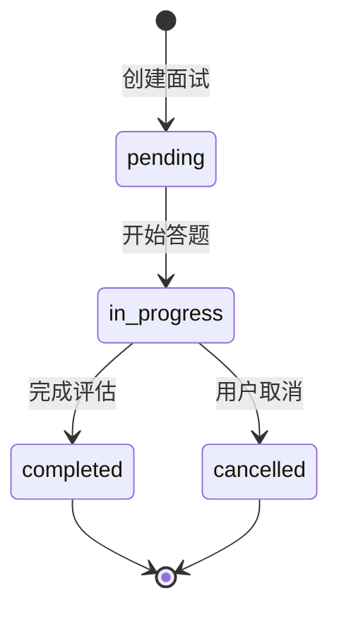
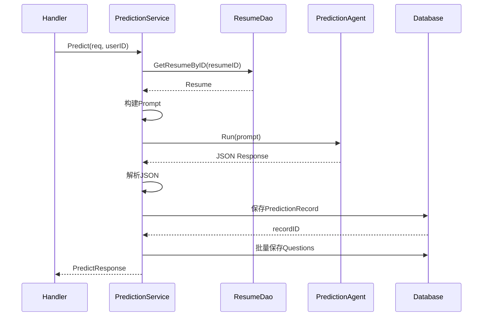
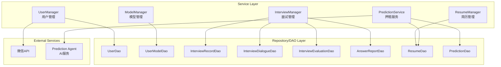

# 业务逻辑层 (Service Layer)

> 理解系统的业务逻辑处理和服务组织方式

## 📋 学习任务

1. 阅读 `backend/internal/service/` 目录下的所有服务
2. 理解服务层的职责和分层架构
3. 掌握业务逻辑的处理流程
4. 理解服务之间的依赖关系

---

## Service层的职责

### 核心职责

Service层位于Handler层和Repository层之间，承担以下职责：

| 职责 | 说明 | 示例 |
|------|------|------|
| **业务逻辑编排** | 协调多个Repository完成复杂业务 | 创建面试时同时创建记录和初始化对话 |
| **数据转换** | 在DTO和Model之间进行转换 | InterviewRecordDTO ↔ InterviewRecord |
| **业务规则验证** | 执行业务层面的校验逻辑 | 验证简历属于该用户、设置默认简历时取消其他默认 |
| **事务管理** | 协调跨多个表的事务操作 | 设置默认模型时取消其他模型的默认状态 |
| **外部服务调用** | 调用第三方API或AI服务 | 微信登录、调用Prediction Agent生成押题 |
| **错误处理** | 统一的错误处理和日志记录 | 捕获panic、记录详细日志、返回友好错误 |

### 分层架构

```
┌─────────────────────────────────────┐
│      Handler Layer (API层)          │  ← 处理HTTP请求
├─────────────────────────────────────┤
│      Service Layer (业务逻辑层)       │  ← 业务逻辑编排
├─────────────────────────────────────┤
│   Repository Layer (数据访问层)       │  ← 数据库操作
├─────────────────────────────────────┤
│      Model Layer (数据模型层)        │  ← 数据结构定义
└─────────────────────────────────────┘
```

**Service层的定位**:
- 不直接操作数据库（通过Repository/DAO）
- 不处理HTTP细节（由Handler负责）
- 专注于业务逻辑和流程编排
- 可以被多个Handler复用

---

## 服务组织结构

### 目录结构

```
backend/internal/service/
├── user/                    # 用户相关服务
│   ├── interface.go        # 服务接口定义
│   └── impl/               # 服务实现
│       ├── user_impl.go           # 用户管理实现
│       └── user_model_impl.go     # 用户模型管理实现
├── interviews/             # 面试相关服务
│   ├── interface.go        # 服务接口定义
│   └── impl/               # 服务实现
│       ├── interview_impl.go      # 面试管理实现
│       └── resume_manager_impl.go # 简历管理实现
├── prediction/             # 押题相关服务
│   ├── interface.go        # 服务接口定义
│   └── impl/               # 服务实现
│       └── prediction_impl.go     # 押题实现
└── common/                 # 公共服务
    └── util.go            # 工具函数（API密钥加密/解密）
```

### 设计模式

**接口 + 实现分离**:
```go
// interface.go - 定义接口
package user

type UserManager interface {
    Register(ctx context.Context, req userapi.RegisterRequest) (*userapi.LoginResponse, error)
    Login(ctx context.Context, req userapi.LoginRequest) (*userapi.LoginResponse, error)
    // ... 其他方法
}

// 工厂函数
func NewUserManager() UserManager {
    return impl.NewUserServer()
}

// impl/user_impl.go - 实现接口
package impl

type UserServer struct {
    httpClient *http.Client
}

func (s *UserServer) Register(ctx context.Context, req userapi.RegisterRequest) (*userapi.LoginResponse, error) {
    // 实现逻辑
}
```

**优势**:
1. **解耦**: Handler只依赖接口，不依赖具体实现
2. **可测试**: 便于Mock和单元测试
3. **可替换**: 可以轻松切换不同的实现
4. **清晰**: 接口定义即服务契约

---

## 核心服务详解

### 1. UserManager - 用户管理服务

**文件位置**: [backend/internal/service/user/impl/user_impl.go](../../backend/internal/service/user/impl/user_impl.go)

**职责**: 处理用户注册、登录、个人信息管理、微信登录

#### 核心方法

| 方法 | 功能 | 业务逻辑 |
|------|------|---------|
| `Register` | 用户注册 | 1. 检查用户名/邮箱是否已存在<br>2. 创建用户记录（密码明文存储，生产环境应加密）<br>3. 生成JWT token<br>4. 返回token和用户信息 |
| `Login` | 用户登录 | 1. 根据邮箱查询用户<br>2. 验证密码<br>3. 生成JWT token<br>4. 返回token和用户信息 |
| `GetProfile` | 获取用户资料 | 根据userID查询用户信息并转换为DTO |
| `UpdateProfile` | 更新用户资料 | 更新用户名/邮箱字段 |
| `WechatLogin` | 微信登录 | 生成微信OAuth二维码登录URL |
| `WechatCallback` | 微信回调处理 | 1. 使用code换取access_token<br>2. 获取微信用户信息<br>3. 根据OpenID查询或创建用户<br>4. 生成JWT token |

#### 关键代码片段

**用户注册逻辑**:
```go
func (s *UserServer) Register(ctx context.Context, req userapi.RegisterRequest) (*userapi.LoginResponse, error) {
    // 1. 检查用户是否已存在
    _, err := model.UserDao.FindByUsernameOrEmail(req.GetUsername(), req.GetEmail())
    if err == nil {
        return nil, errors.New("用户名或邮箱已存在")
    }
    if !errors.Is(err, gorm.ErrRecordNotFound) {
        return nil, err
    }

    // 2. 创建用户记录
    userRecord := &model.User{
        Username:     req.GetUsername(),
        Email:        req.GetEmail(),
        PasswordHash: req.GetPassword(),  // 注意：生产环境应使用bcrypt加密
        Role:         "user",
    }

    if err := model.UserDao.Create(userRecord); err != nil {
        return nil, err
    }

    // 3. 生成JWT token
    token, err := middleware.GenerateToken(userRecord.ID, userRecord.Username, userRecord.Role)
    if err != nil {
        return nil, err
    }

    // 4. 返回响应
    return s.buildLoginResponse(token, userRecord), nil
}
```

**微信登录流程**:
```go
func (s *UserServer) WechatCallback(ctx context.Context, req userapi.WechatCallbackRequest) (*userapi.LoginResponse, error) {
    // 1. 使用授权码换取access_token
    tokenResp, err := s.getWechatAccessToken(ctx, req.GetCode())
    if err != nil {
        return nil, err
    }

    // 2. 使用access_token获取用户信息
    userInfo, err := s.getWechatUserInfo(ctx, tokenResp.AccessToken, tokenResp.OpenID)
    if err != nil {
        return nil, err
    }

    // 3. 根据OpenID查询或创建用户
    userRecord, err := s.wechatLoginOrRegister(ctx, tokenResp, userInfo)
    if err != nil {
        return nil, err
    }

    // 4. 生成JWT token
    token, err := middleware.GenerateToken(userRecord.ID, userRecord.Username, userRecord.Role)
    if err != nil {
        return nil, err
    }

    return s.buildLoginResponse(token, userRecord), nil
}
```

**我的理解**: UserManager采用了经典的用户认证模式。注册时先检查唯一性，避免重复注册。微信登录实现了OAuth 2.0授权流程，支持用户通过微信快速登录。使用JWT token实现无状态认证，便于前后端分离和横向扩展。注意：当前密码是明文存储（PasswordHash字段实际存的是明文），生产环境应该使用bcrypt等哈希算法加密存储。

---

### 2. ModelManager - 用户模型管理服务

**文件位置**: [backend/internal/service/user/impl/user_model_impl.go](../../backend/internal/service/user/impl/user_model_impl.go)

**职责**: 管理用户配置的AI模型（支持多模型）

#### 核心方法

| 方法 | 功能 | 业务逻辑 |
|------|------|---------|
| `CreateUserModel` | 创建模型配置 | 1. 加密API密钥<br>2. 如果设为默认，取消其他模型默认状态<br>3. 保存模型配置<br>4. 如果启用状态=1，设置为启用模型 |
| `ListUserModels` | 列出用户模型 | 分页查询用户的所有模型配置 |
| `UserModelDetail` | 获取模型详情 | 根据modelID查询模型详情 |
| `UpdateUserModel` | 更新模型配置 | 1. 更新模型信息<br>2. 如果修改API密钥则重新加密<br>3. 处理默认状态变更 |
| `DeleteUserModel` | 删除模型 | 软删除用户模型配置 |
| `CheckUserModelConfigured` | 检查默认模型 | 查询用户是否配置了默认模型 |

#### 关键业务逻辑

**1. API密钥加密**:
```go
// 创建时加密
apiKey, err := common.EncryptAPIKey(req.APIKey)
if err != nil {
    return "fail", errors.New("密钥加密失败")
}

newModel := &model.UserModel{
    APIKeyEncrypted: apiKey,
    // ... 其他字段
}
```

使用AES-CBC加密算法，密钥从环境变量 `USER_MODEL_API_KEY_SECRET` 获取，默认为 `usermodel16bytes`（16字节用于AES-128）。

**2. 默认模型管理**:
```go
// 如果设为默认，先取消其他模型的默认状态
if isDefault == 1 {
    _ = model.UserModelDao.CancelDefaultUserModel(userID, 0) // 0 表示取消所有
}

// 保存新模型
newModel := &model.UserModel{
    IsDefault: isDefault,
    // ... 其他字段
}
```

**3. 启用模型管理**:
```go
// 如果设置为启用状态，将其他模型设为禁用
if status == 1 {
    _ = model.UserModelDao.SetEnabledUserModel(userID, int64(newModel.ID))
}
```

**我的理解**: ModelManager实现了多模型配置管理，允许用户配置多个AI模型（如OpenAI、豆包、DeepSeek等）并在它们之间切换。API密钥加密保护了用户的敏感信息。默认模型和启用模型是两个独立的概念：默认模型用于快速选择，启用模型决定当前使用哪个。这种设计提供了灵活性，用户可以配置多个模型但只激活一个使用。

---

### 3. InterviewManager - 面试管理服务

**文件位置**: [backend/internal/service/interviews/impl/interview_impl.go](../../backend/internal/service/interviews/impl/interview_impl.go)

**职责**: 管理面试记录、对话、评估报告和答题报告

#### 核心方法

| 方法 | 功能 | 业务逻辑 |
|------|------|---------|
| `CreateInterviewRecord` | 创建面试记录 | 1. 处理可选字段（公司名、岗位名）<br>2. 初始化状态为pending<br>3. 创建面试记录并返回ID |
| `UpdateInterviewRecord` | 更新面试记录 | 更新面试状态、耗时等字段 |
| `ListInterviewRecords` | 获取面试列表 | 分页查询用户的面试记录并转换为DTO |
| `GetInterviewEvaluation` | 获取评估报告 | 根据reportID查询评估数据（总体评分、各维度评分） |
| `GetAnswerReport` | 获取答题报告 | 根据reportID查询答题记录（每题的问答和评价） |
| `SaveInterviewDialogueWithParent` | 保存面试对话 | 支持主问题和追问的层级结构（当前未使用ParentID） |

#### 面试状态流转



**状态说明**:
- `pending`: 待开始 - 面试已创建但未开始
- `in_progress`: 进行中 - 面试正在进行（前端状态，后端可能未使用）
- `completed`: 已完成 - 面试已结束并生成评估
- `cancelled`: 已取消 - 用户中途取消（可选状态）

#### 数据转换示例

**Model → DTO转换**:
```go
func convertToInterviewRecordDTO(record *model.InterviewRecord) *interviewsapi.InterviewRecordDTO {
    dto := interviewsapi.NewInterviewRecordDTO()
    dto.ID = int64(record.ID)
    dto.UserID = int32(record.UserID)
    dto.Type = record.Type
    dto.Difficulty = record.Difficulty
    dto.Domain = record.Domain
    dto.Status = record.Status

    // 处理可选字段
    if record.CompanyName != "" {
        v := record.CompanyName
        dto.CompanyName = &v
    }
    if record.PositionName != "" {
        v := record.PositionName
        dto.PositionName = &v
    }
    
    // 转换时间为毫秒时间戳
    if !record.CreatedAt.IsZero() {
        ms := record.CreatedAt.UnixNano() / int64(1000000)
        dto.CreatedAt = &ms
    }

    return dto
}
```

**我的理解**: InterviewManager负责面试全生命周期管理。创建面试时只创建主记录，后续通过Agent交互生成对话、评估和答题报告。状态流转清晰，支持面试的完整流程追踪。数据转换层将内部Model转换为API层的DTO，隔离了内部实现细节。注意时间字段的转换：Model使用time.Time，API使用毫秒时间戳，这是前后端数据交换的常见模式。

---

### 4. ResumeManager - 简历管理服务

**文件位置**: [backend/internal/service/interviews/impl/resume_manager_impl.go](../../backend/internal/service/interviews/impl/resume_manager_impl.go)

**职责**: 管理用户简历的上传、更新、删除和查询

#### 核心方法

| 方法 | 功能 | 业务逻辑 |
|------|------|---------|
| `UploadResume` | 上传简历 | 1. 创建Resume记录<br>2. 存储文件元信息和内容<br>3. 返回简历ID |
| `SetDefaultResume` | 设置默认简历 | 1. 取消其他简历的默认状态<br>2. 将指定简历设为默认 |
| `UpdateResume` | 更新简历 | 更新简历的文件名和内容 |
| `DeleteResume` | 删除简历 | 1. 验证简历归属<br>2. 软删除简历 |
| `GetResumeInfoByID` | 获取简历详情 | 根据resumeID查询简历信息 |
| `GetDefaultResumeInfo` | 获取默认简历 | 查询用户的默认简历 |
| `ListResumeInfosByUserID` | 列出用户简历 | 分页查询用户的所有简历 |

#### 关键业务逻辑

**1. 上传简历**:
```go
func (s *ResumeServer) UploadResume(
    ctx context.Context,
    userID uint,
    fileName string,
    fileType string,
    fileSize int64,
    content string,
) (uint64, error) {
    resume := &model.Resume{
        UserID:    userID,
        Content:   content,      // 简历文本内容（已解析）
        FileName:  fileName,     // 原始文件名
        FileSize:  fileSize,     // 文件大小（字节）
        FileType:  fileType,     // 文件类型（pdf/doc/txt）
        IsDefault: 0,           // 初始不设为默认
        Deleted:   0,           // 未删除
    }

    resumeID, err := model.ResumeDao.CreateResume(resume)
    if err != nil {
        log.Printf("[UploadResume] 创建简历失败: %v", err)
        return 0, err
    }

    log.Printf("[UploadResume] 简历上传成功: userID=%d, resumeID=%d, fileName=%s", 
        userID, resumeID, fileName)
    return resumeID, nil
}
```

**2. 设置默认简历**:
```go
func (s *ResumeServer) SetDefaultResume(
    ctx context.Context,
    userID uint,
    resumeID uint64,
) error {
    // DAO层会执行事务：
    // 1. 取消该用户所有简历的默认状态 (UPDATE is_default = 0)
    // 2. 将指定简历设为默认 (UPDATE is_default = 1)
    err := model.ResumeDao.SetDefaultResume(userID, resumeID)
    if err != nil {
        log.Printf("[SetDefaultResume] 设置默认简历失败: %v", err)
        return err
    }

    log.Printf("[SetDefaultResume] 默认简历设置成功: userID=%d, resumeID=%d", userID, resumeID)
    return nil
}
```

**3. 删除简历权限验证**:
```go
func (s *ResumeServer) DeleteResume(
    ctx context.Context,
    userID uint,
    resumeID uint64,
) error {
    // 1. 先查询简历
    resume, err := model.ResumeDao.GetResumeByID(resumeID)
    if err != nil {
        log.Printf("[DeleteResume] 获取简历失败: %v", err)
        return err
    }

    // 2. 验证简历属于该用户
    if resume.UserID != userID {
        log.Printf("[DeleteResume] 用户无权删除该简历: userID=%d, resumeID=%d", userID, resumeID)
        return errors.New("unauthorized")
    }

    // 3. 执行软删除
    err = model.ResumeDao.DeleteResume(resumeID)
    if err != nil {
        log.Printf("[DeleteResume] 删除简历失败: %v", err)
        return err
    }

    log.Printf("[DeleteResume] 简历删除成功: userID=%d, resumeID=%d", userID, resumeID)
    return nil
}
```

**我的理解**: ResumeManager实现了完整的简历生命周期管理。上传简历时存储的是解析后的文本内容（Content字段），这使得后续的AI分析更加方便。默认简历机制简化了用户体验，在面试和押题时可以自动使用默认简历。删除前的权限验证非常重要，防止用户删除他人的简历。所有关键操作都有详细的日志记录，便于问题排查。

---

### 5. PredictionService - 押题服务

**文件位置**: [backend/internal/service/prediction/impl/prediction_impl.go](../../backend/internal/service/prediction/impl/prediction_impl.go)

**职责**: 基于简历和要求生成面试题目

#### 核心方法

| 方法 | 功能 | 业务逻辑 |
|------|------|---------|
| `Predict` | 生成押题 | 1. 查询简历内容<br>2. 构建Prompt<br>3. 调用Prediction Agent<br>4. 解析JSON响应<br>5. 保存押题记录和题目 |
| `ListPredictions` | 列出押题记录 | 分页查询用户的押题历史 |
| `GetPredictionDetail` | 获取押题详情 | 查询指定押题记录的所有题目 |

#### Predict流程详解



**步骤详解**:

**1. 构建Prompt**:
```go
prompt := fmt.Sprintf(`
简历内容：
%s

押题要求：
- 类型：%s
- 语言：%s
- 岗位：%s
- 难度：%s
`, resume.Content, req.PredictionType, req.Language, req.JobTitle, req.Difficulty)

if req.CompanyName != nil {
    prompt += fmt.Sprintf("- 目标公司：%s\n", *req.CompanyName)
}
```

**2. 调用Agent**:
```go
// 创建Prediction Agent
agent, err := predictionAgent.NewPredictionAgent(userID)
if err != nil {
    return nil, err
}

// 使用Runner运行Agent
runner := adk.NewRunner(ctx, adk.RunnerConfig{
    Agent: agent,
})

// 构建消息
messages := []adk.Message{
    schema.UserMessage(prompt),
}

// 运行智能体
iter := runner.Run(ctx, messages)

var content string
for {
    event, ok := iter.Next()
    if !ok {
        break
    }

    if event.Err != nil {
        return nil, fmt.Errorf("agent generation failed: %w", event.Err)
    }

    // 收集最后一条消息内容
    if event.Output != nil && event.Output.MessageOutput != nil {
        message := event.Output.MessageOutput.Message.Content
        if message != "" {
            content = message
        }
    }
}
```

**3. 清理和解析JSON**:
```go
// 清理可能存在的Markdown代码块标记
content = cleanJSONContent(content)

// 辅助函数：清理markdown标记
func cleanJSONContent(content string) string {
    content = strings.TrimSpace(content)
    // 去除开头的 ```json 或 ```
    if strings.HasPrefix(content, "```") {
        if idx := strings.Index(content, "\n"); idx != -1 {
            content = content[idx+1:]
        }
    }
    // 去除结尾的 ```
    if strings.HasSuffix(content, "```") {
        content = content[:len(content)-3]
    }
    return strings.TrimSpace(content)
}

// 解析JSON
var result predictionAgent.PredictionResult
err = json.Unmarshal([]byte(content), &result)
if err != nil {
    return nil, fmt.Errorf("failed to parse agent response: %v", err)
}
```

**4. 保存到数据库**:
```go
// 先保存主记录
record := &model.PredictionRecord{
    UserID:     userID,
    ResumeID:   uint64(req.ResumeID),
    Type:       req.PredictionType,
    Language:   req.Language,
    JobTitle:   req.JobTitle,
    Difficulty: req.Difficulty,
    Company:    req.CompanyName,
}

if err := model.PredictionDao.CreatePredictionRecord(record); err != nil {
    return nil, fmt.Errorf("failed to save main record: %w", err)
}

// 准备题目列表
var questions []model.PredictionQuestion
for i, q := range result.Questions {
    // 处理FollowUp字段（可能是string或数组）
    var followUpStr string
    switch v := q.FollowUp.(type) {
    case string:
        followUpStr = v
    default:
        // 将其他类型转换为JSON字符串
        b, _ := json.Marshal(v)
        followUpStr = string(b)
    }

    questions = append(questions, model.PredictionQuestion{
        RecordID:        record.ID,
        Question:        q.Question,
        Content:         q.Content,
        Focus:           q.Focus,
        ThinkingPath:    q.ThinkingPath,
        ReferenceAnswer: q.ReferenceAnswer,
        FollowUp:        followUpStr,
        Sort:            i + 1,
    })
}

// 批量保存题目
if err := model.PredictionDao.CreatePredictionQuestions(questions); err != nil {
    return nil, fmt.Errorf("failed to save questions: %w", err)
}
```

#### 错误处理和恢复

```go
func (s *PredictionServiceImpl) Predict(ctx context.Context, req *predictionIDL.PredictRequest, userID uint) (resp *predictionIDL.PredictResponse, err error) {
    // Panic恢复机制
    defer func() {
        if r := recover(); r != nil {
            log.Printf("[Prediction] Panic recovered: %v", r)
            err = fmt.Errorf("internal server error: panic recovered")
        }
    }()

    // ... 业务逻辑
}
```

**我的理解**: PredictionService是最复杂的服务，因为它需要调用AI Agent生成内容。关键点：1) Prompt构建要包含简历全文和详细要求；2) Agent返回的内容可能包含Markdown代码块标记，需要清理后再解析；3) FollowUp字段可能是字符串或数组，需要灵活处理；4) 使用defer+recover捕获panic，避免服务崩溃；5) 详细的日志记录便于排查AI生成问题。分步保存策略确保主记录和题目的事务一致性。

---

## 公共服务

### common包 - API密钥加密工具

**文件位置**: [backend/internal/service/common/util.go](../../backend/internal/service/common/util.go)

**职责**: 提供API密钥的加密和解密功能

#### 核心功能

| 函数 | 功能 | 说明 |
|------|------|------|
| `EncryptAPIKey` | 加密API密钥 | 使用AES-CBC加密算法 |
| `DecryptAPIKey` | 解密API密钥 | 支持向后兼容 |
| `getSecret` | 获取加密密钥 | 从环境变量或使用默认值 |

#### 实现细节

```go
const (
    // API密钥加密密钥环境变量
    APIKeySecretEnv = "USER_MODEL_API_KEY_SECRET"
    
    // 默认加密密钥（16字节，用于 AES-128）
    DefaultAPIKeySecret = "usermodel16bytes" // 正好 16 字节
)

// 获取加密密钥
func getSecret() string {
    secret := os.Getenv(APIKeySecretEnv)
    if secret == "" {
        secret = DefaultAPIKeySecret
    }
    return secret
}

// 加密API密钥
func EncryptAPIKey(apiKey string) (string, error) {
    secret := getSecret()
    return encrypt.EncryptByAES([]byte(apiKey), secret)
}

// 解密API密钥
func DecryptAPIKey(encrypted string) (string, error) {
    secret := getSecret()
    data, err := encrypt.DecryptByAES(encrypted, secret)
    if err != nil {
        return "", err
    }
    return string(data), nil
}
```

**使用示例**:
```go
// 在创建用户模型时加密
apiKey, err := common.EncryptAPIKey(req.APIKey)
if err != nil {
    return "fail", errors.New("密钥加密失败")
}

userModel := &model.UserModel{
    APIKeyEncrypted: apiKey,
    // ... 其他字段
}

// 在调用API时解密
decryptedKey, err := common.DecryptAPIKey(userModel.APIKeyEncrypted)
if err != nil {
    return err
}
// 使用 decryptedKey 调用AI API
```

**安全考虑**:
1. **密钥管理**: 生产环境应通过环境变量设置密钥，不要使用默认值
2. **密钥长度**: AES-128需要16字节，AES-256需要32字节
3. **密钥轮换**: 定期更换加密密钥，需要重新加密所有旧数据
4. **传输安全**: 确保HTTPS传输，避免中间人攻击

**我的理解**: API密钥加密是保护用户敏感信息的关键措施。使用AES-CBC对称加密算法，性能好且足够安全（前提是密钥管理得当）。环境变量配置使得密钥可以根据环境动态设置。注意默认密钥 `usermodel16bytes` 只适合开发环境，生产环境必须使用强随机密钥。这个工具函数被UserModelService复用，体现了代码复用原则。

---

## 服务层最佳实践

### 1. 接口设计原则

**单一职责**:
```go
// ✅ 好的设计：职责清晰
type UserManager interface {
    Register(ctx context.Context, req RegisterRequest) (*LoginResponse, error)
    Login(ctx context.Context, req LoginRequest) (*LoginResponse, error)
}

type ModelManager interface {
    CreateUserModel(ctx context.Context, userID int64, req CreateUserModelRequest) (string, error)
    ListUserModels(ctx context.Context, userID int64, req ListUserModelsRequest) ([]*UserModel, int64, error)
}

// ❌ 不好的设计：职责混乱
type UserService interface {
    Register(ctx context.Context, req RegisterRequest) (*LoginResponse, error)
    CreateUserModel(ctx context.Context, userID int64, req CreateUserModelRequest) (string, error)  // 模型管理混在用户服务中
}
```

**依赖注入**:
```go
// ✅ 推荐：通过接口依赖，便于测试和替换
type InterviewService struct {
    resumeManager ResumeManager  // 依赖接口
}

// ❌ 不推荐：直接依赖具体实现
type InterviewService struct {
    resumeServer *ResumeServer  // 依赖具体类型
}
```

### 2. 错误处理

**统一错误处理**:
```go
func (s *ResumeServer) UploadResume(
    ctx context.Context,
    userID uint,
    fileName string,
    fileType string,
    fileSize int64,
    content string,
) (uint64, error) {
    resume := &model.Resume{ /* ... */ }

    resumeID, err := model.ResumeDao.CreateResume(resume)
    if err != nil {
        // ✅ 记录详细日志
        log.Printf("[UploadResume] 创建简历失败: %v", err)
        // ✅ 返回错误给上层处理
        return 0, err
    }

    // ✅ 记录成功日志
    log.Printf("[UploadResume] 简历上传成功: userID=%d, resumeID=%d", userID, resumeID)
    return resumeID, nil
}
```

**Panic恢复**:
```go
func (s *PredictionServiceImpl) Predict(ctx context.Context, req *predictionIDL.PredictRequest, userID uint) (resp *predictionIDL.PredictResponse, err error) {
    // ✅ 使用defer恢复panic
    defer func() {
        if r := recover(); r != nil {
            log.Printf("[Prediction] Panic recovered: %v", r)
            err = fmt.Errorf("internal server error: panic recovered")
        }
    }()

    // 业务逻辑...
}
```

### 3. 日志记录

**关键操作日志**:
```go
// ✅ 记录关键参数和结果
log.Printf("[CreateInterviewRecord] 面试记录创建成功，ID: %d，用户ID: %d", recordID, dto.UserID)

// ✅ 记录失败原因
log.Printf("[CreateInterviewRecord] 创建面试记录失败: %v", err)

// ✅ 记录安全相关操作
log.Printf("[DeleteResume] 用户无权删除该简历: userID=%d, resumeID=%d", userID, resumeID)
```

**日志级别建议**:
- `Debug`: 详细的流程信息
- `Info`: 关键操作成功
- `Warn`: 可恢复的异常
- `Error`: 操作失败
- `Fatal`: 系统级错误

### 4. 数据转换

**清晰的转换层**:
```go
// ✅ 专门的转换函数
func convertToInterviewRecordDTO(record *model.InterviewRecord) *interviewsapi.InterviewRecordDTO {
    dto := interviewsapi.NewInterviewRecordDTO()
    dto.ID = int64(record.ID)
    dto.UserID = int32(record.UserID)
    // ... 其他字段
    return dto
}

// 使用转换函数
for _, record := range records {
    dto := convertToInterviewRecordDTO(record)
    dtoList = append(dtoList, dto)
}
```

**处理可选字段**:
```go
// ✅ 使用指针表示可选字段
if record.CompanyName != "" {
    v := record.CompanyName
    dto.CompanyName = &v
}

// ✅ 检查指针是否为nil
companyName := ""
if dto.CompanyName != nil {
    companyName = *dto.CompanyName
}
```

### 5. 事务管理

**DAO层处理事务**:
```go
// ✅ 在DAO层使用事务
func (dao *_Resume) SetDefaultResume(userID uint, resumeID uint64) error {
    tx := getDB().Begin()  // 开启事务
    
    // 1. 取消所有默认
    if err := tx.Model(&Resume{}).
        Where("user_id = ? AND deleted = 0", userID).
        Update("is_default", 0).Error; err != nil {
        tx.Rollback()  // 回滚
        return err
    }
    
    // 2. 设置新默认
    if err := tx.Model(&Resume{}).
        Where("id = ? AND user_id = ? AND deleted = 0", resumeID, userID).
        Update("is_default", 1).Error; err != nil {
        tx.Rollback()  // 回滚
        return err
    }
    
    return tx.Commit().Error  // 提交
}
```

### 6. Context传递

**正确使用Context**:
```go
// ✅ 接收并传递context
func (s *UserServer) Register(ctx context.Context, req userapi.RegisterRequest) (*userapi.LoginResponse, error) {
    // 可以从context中获取trace_id、user_id等
    // 可以使用context控制超时
    
    // 传递context给下游
    if err := model.UserDao.CreateWithContext(ctx, userRecord); err != nil {
        return nil, err
    }
}
```

---

## 服务依赖关系



**依赖说明**:
- **向下依赖**: Service层依赖DAO层和外部服务
- **横向隔离**: Service之间不直接依赖（通过接口依赖）
- **向上服务**: Service层被Handler层调用

---

## ❓ 问题记录

### Q1: Service层和DAO层的职责如何划分？
**我的理解**: **DAO层**只负责纯粹的数据库操作（CRUD），不包含业务逻辑；**Service层**负责业务逻辑编排、调用多个DAO、处理事务、调用外部服务等。例如：设置默认简历时，Service层只需调用`SetDefaultResume`方法，DAO层内部处理取消其他默认+设置新默认的事务逻辑。这样Service层代码更简洁，DAO层可以被不同Service复用。

### Q2: 为什么需要DTO转换？直接返回Model不行吗？
**我的理解**: DTO（Data Transfer Object）转换的必要性：1) **解耦**: API层的数据结构可以独立演进，不受数据库表结构影响；2) **安全**: 可以隐藏敏感字段（如password_hash）；3) **灵活性**: API可以组合多个Model的数据，或者只返回部分字段；4) **类型适配**: Model使用time.Time，API使用毫秒时间戳；Model使用uint/uint64，API使用int32/int64。虽然增加了代码量，但提高了系统的可维护性和安全性。

### Q3: 为什么PredictionService需要panic恢复？
**我的理解**: PredictionService调用AI Agent，这是一个复杂且不完全可控的外部依赖。可能的风险：1) AI返回的JSON格式不符合预期导致解析panic；2) 内存溢出（简历内容过大）；3) Agent内部错误；4) 第三方库的bug。使用defer+recover可以捕获这些panic，避免整个服务崩溃，并返回友好的错误信息给用户。这是防御性编程的实践，在调用不可控外部服务时尤其重要。

### Q4: 为什么API密钥需要加密存储？
**我的理解**: API密钥加密存储的重要性：1) **安全合规**: 敏感信息不能明文存储，是安全基线要求；2) **防止泄露**: 即使数据库被攻击，加密的密钥也无法直接使用；3) **多租户隔离**: 每个用户的API密钥独立加密，降低批量泄露风险；4) **审计追踪**: 加密操作可以记录日志，追踪密钥的使用情况。虽然增加了一定的性能开销，但安全性的提升是值得的。注意：加密密钥本身的管理也很关键，不能硬编码在代码中，应该通过环境变量或密钥管理服务注入。

---

## 🔬 实践验证

### 任务1: 追踪用户注册流程
```bash
# 1. 启动服务
cd backend && go run main.go

# 2. 使用Postman发送注册请求
POST http://localhost:8888/api/v1/user/register
{
    "username": "testuser",
    "email": "test@example.com",
    "password": "123456"
}

# 3. 观察日志输出
# 4. 查看数据库user表
```

**我的发现**: _____

### 任务2: 测试默认简历设置
```bash
# 1. 上传第一份简历
POST /api/v1/resume/upload

# 2. 上传第二份简历
POST /api/v1/resume/upload

# 3. 设置第二份为默认
POST /api/v1/resume/{id}/set-default

# 4. 查询简历列表，验证is_default字段
GET /api/v1/resume/list
```

**我的发现**: _____

### 任务3: 体验押题流程
```bash
# 1. 上传简历
# 2. 配置AI模型
# 3. 调用押题接口
POST /api/v1/prediction/predict
{
    "resume_id": 1,
    "prediction_type": "校招",
    "language": "golang",
    "job_title": "后端开发",
    "difficulty": "中等"
}

# 4. 观察Agent调用过程
# 5. 查看生成的题目
```

**我的发现**: _____

---

## ✅ 学习检查点

- [ ] 理解Service层的职责和定位
- [ ] 掌握所有核心服务的功能
- [ ] 理解业务逻辑的编排方式
- [ ] 理解DTO和Model的转换
- [ ] 理解事务管理的方式
- [ ] 理解错误处理和日志记录
- [ ] 理解AI服务的调用方式
- [ ] 能够追踪完整的业务流程

---

**下一步**: [业务流程图 (business-flow.md)](business-flow.md)

---

**相关文档**:
- [数据模型详解 (models.md)](../02-data-layer/models.md)
- [Repository模式 (repository-pattern.md)](../02-data-layer/repository-pattern.md)
- [API层文档 (handler-pattern.md)](../04-api-layer/handler-pattern.md)