# 业务流程详解

> 以流程图的方式理解系统的核心业务逻辑

## 📋 学习任务

1. 理解每个核心业务流程的完整路径
2. 掌握服务层的业务逻辑编排方式
3. 理解数据在各层之间的流转
4. 理解外部服务（AI Agent、微信API）的集成方式

---

## 目录

- [1. 用户注册登录流程](#1-用户注册登录流程)
- [2. 微信登录流程](#2-微信登录流程)
- [3. 用户模型管理流程](#3-用户模型管理流程)
- [4. 简历上传解析流程](#4-简历上传解析流程)
- [5. 面试创建流程](#5-面试创建流程)
- [6. 面试进行流程](#6-面试进行流程)
- [7. 押题生成流程](#7-押题生成流程)
- [8. 评估报告生成流程](#8-评估报告生成流程)

---

## 1. 用户注册登录流程

### 1.1 用户注册流程

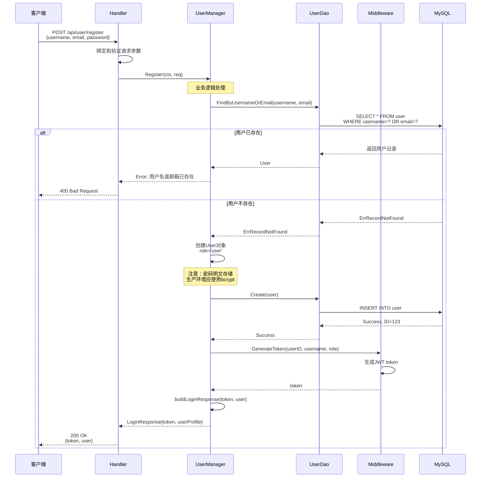

**关键点**:
1. **唯一性检查**: 注册前检查用户名和邮箱是否已存在
2. **默认角色**: 新用户默认角色为 'user'
3. **JWT生成**: 注册成功后立即生成token，实现自动登录
4. **密码安全**: 当前密码明文存储在PasswordHash字段，生产环境应使用bcrypt加密

### 1.2 用户登录流程

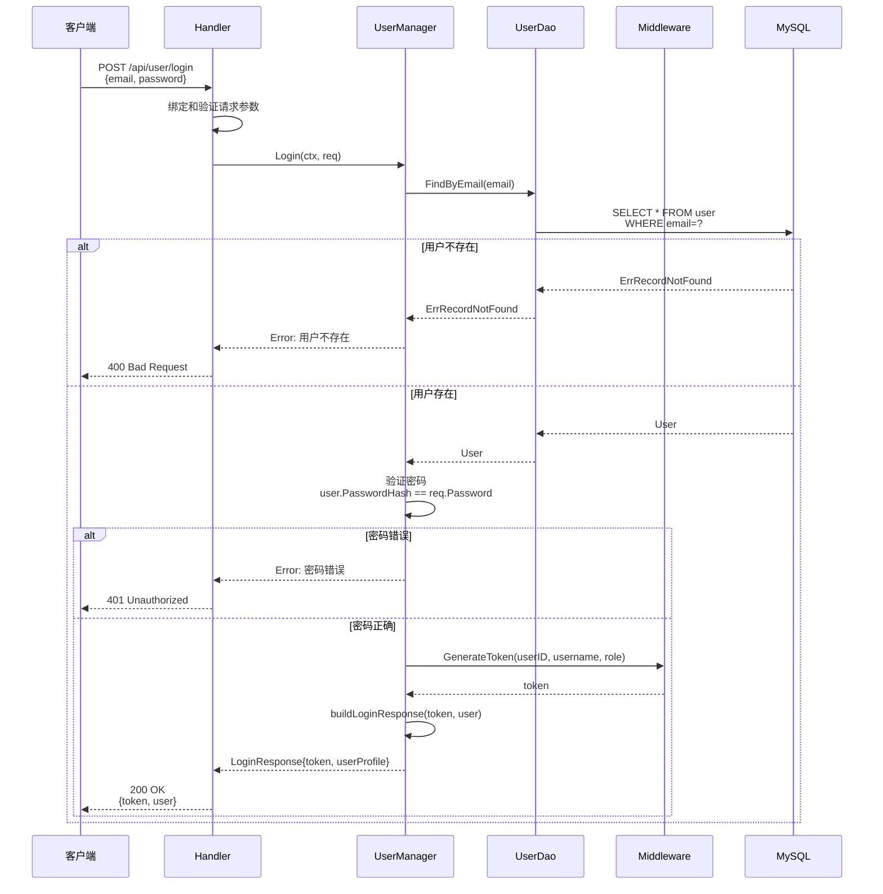

**关键点**:
1. **邮箱登录**: 使用邮箱作为登录凭证
2. **密码验证**: 直接比较明文密码（生产环境应使用bcrypt.CompareHashAndPassword）
3. **错误区分**: 区分"用户不存在"和"密码错误"两种错误情况
4. **Token生成**: 登录成功生成JWT token用于后续认证

---

## 2. 微信登录流程

### 2.1 微信OAuth 2.0 授权流程

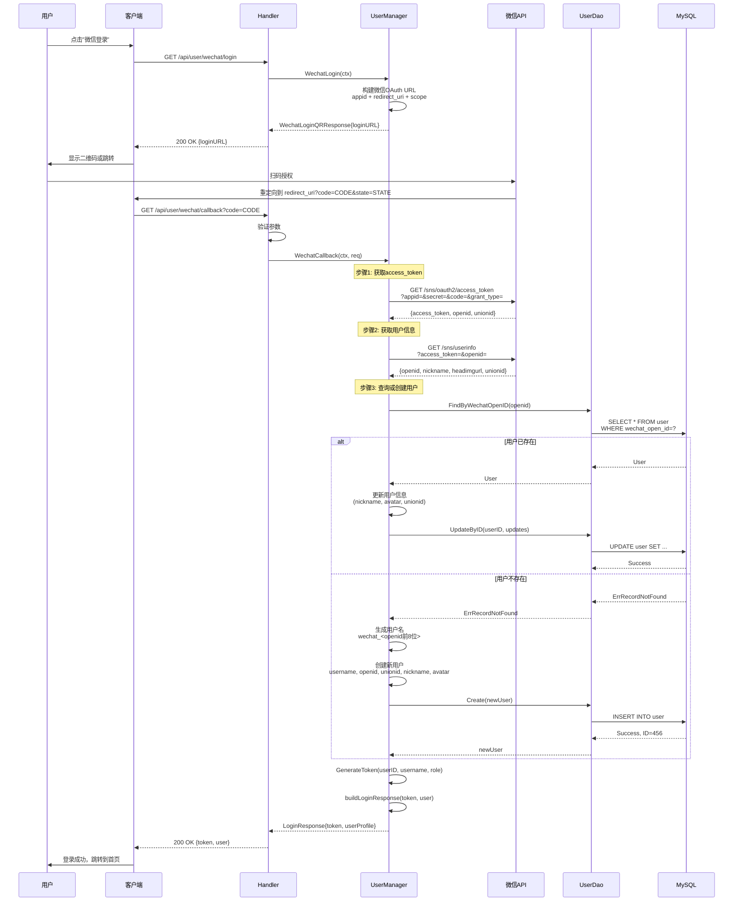

**关键点**:
1. **OAuth 2.0流程**: 标准的授权码模式（Authorization Code）
2. **两步获取**: 先用code换access_token，再用access_token获取用户信息
3. **自动注册**: 首次微信登录自动创建账号
4. **UnionID**: 支持微信多平台（公众号、小程序、网站）用户统一
5. **信息更新**: 每次登录更新微信昵称和头像
6. **用户名生成**: 格式为 `wechat_<openid前8位>`

---

## 3. 用户模型管理流程

### 3.1 创建用户模型配置

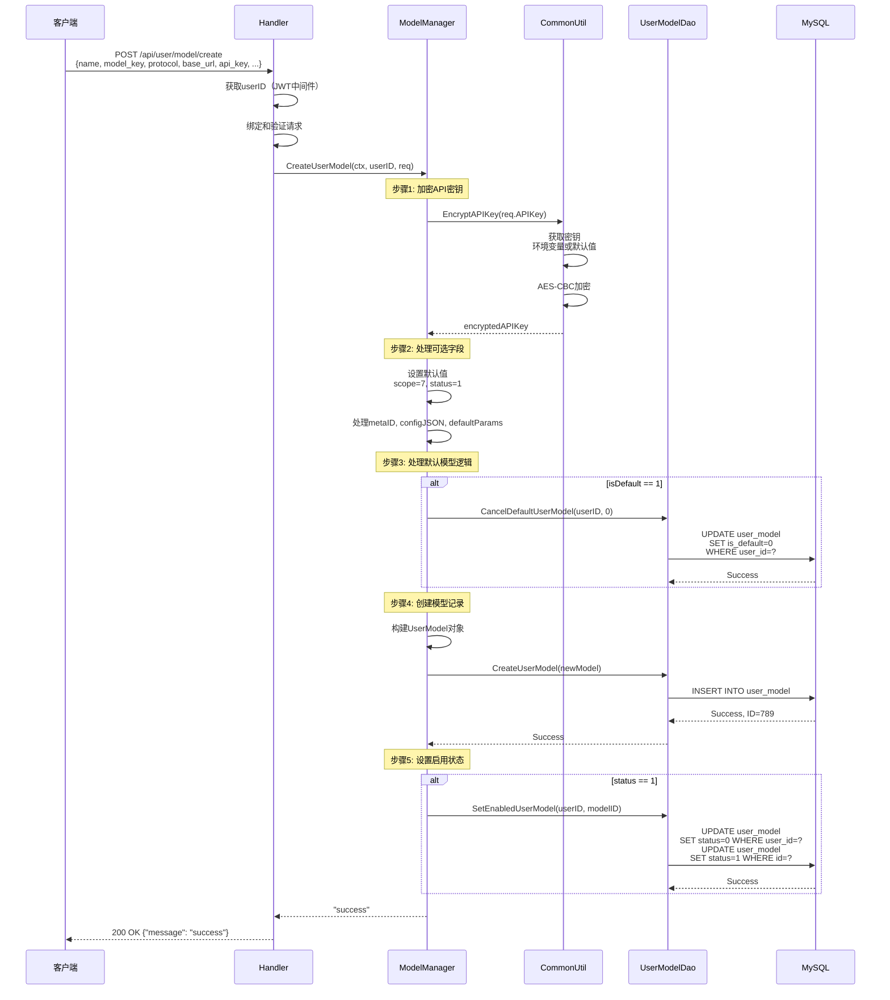

**关键点**:
1. **API密钥加密**: 使用AES-CBC加密存储，密钥从环境变量获取
2. **默认模型管理**: 设为默认时自动取消其他模型的默认状态
3. **启用状态管理**: status=1时将其他模型设为禁用
4. **事务一致性**: 默认状态和启用状态的变更在DAO层使用事务保证

### 3.2 更新用户模型配置

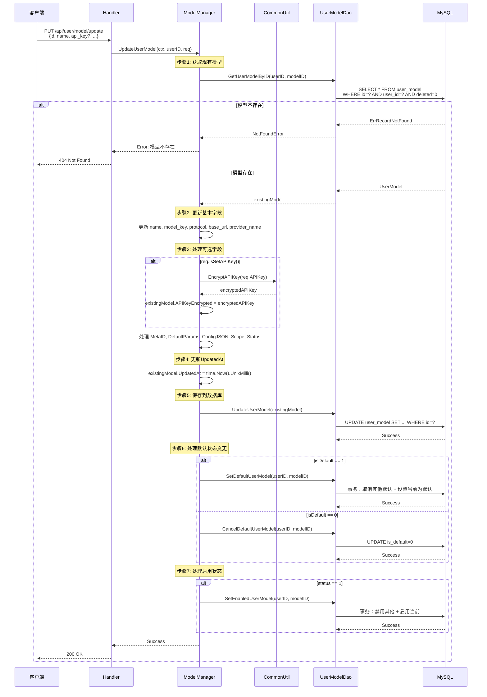

**关键点**:
1. **部分更新**: 只更新提供的字段，未提供的字段保持不变
2. **API密钥可选更新**: 只在提供新密钥时才重新加密
3. **状态管理**: 独立处理默认状态和启用状态的变更
4. **权限验证**: 通过userID确保只能更新自己的模型

---

## 4. 简历上传解析流程

### 4.1 完整的简历上传解析流程

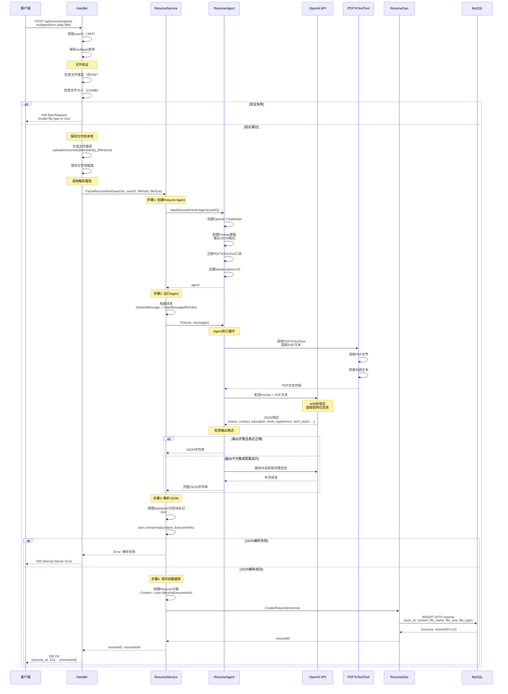

**关键点**:
1. **文件验证**: 只接受PDF格式，最大10MB
2. **本地存储**: 文件保存到 `uploads/resumes/` 目录
3. **AI解析**: 使用OpenAI API + PDFToTextTool工具链
4. **结构化输出**: AI返回JSON格式的简历信息
5. **智能追问**: Agent可以多轮对话获取完整信息（MaxIterations=20）
6. **数据存储**: 解析后的JSON存储在Content字段

### 4.2 简历信息结构

AI解析后返回的JSON结构：
```json
{
  "name": "张三",
  "contact": {
    "phone": "138****8888",
    "email": "zhang@example.com",
    "github": "https://github.com/zhang"
  },
  "education": [
    {
      "institution": "XX大学",
      "degree": "本科",
      "major": "计算机科学与技术",
      "graduation": "2020"
    }
  ],
  "work_experience": [
    {
      "company": "XX科技",
      "position": "后端开发工程师",
      "duration": "2020.07 - 2023.05",
      "description": "负责..."
    }
  ],
  "tech_stack": ["Java", "Spring Boot", "MySQL", "Redis"],
  "projects": [...],
  "skills": [...],
  "strengths": "熟悉分布式系统...",
  "potential_weaknesses": "缺少大规模系统经验...",
  "recommended_difficulty": "中等",
  "interview_focus_areas": ["Spring框架", "数据库优化"],
  "suggested_questions_directions": ["项目架构", "性能优化"]
}
```

---

## 5. 面试创建流程

### 5.1 创建面试记录

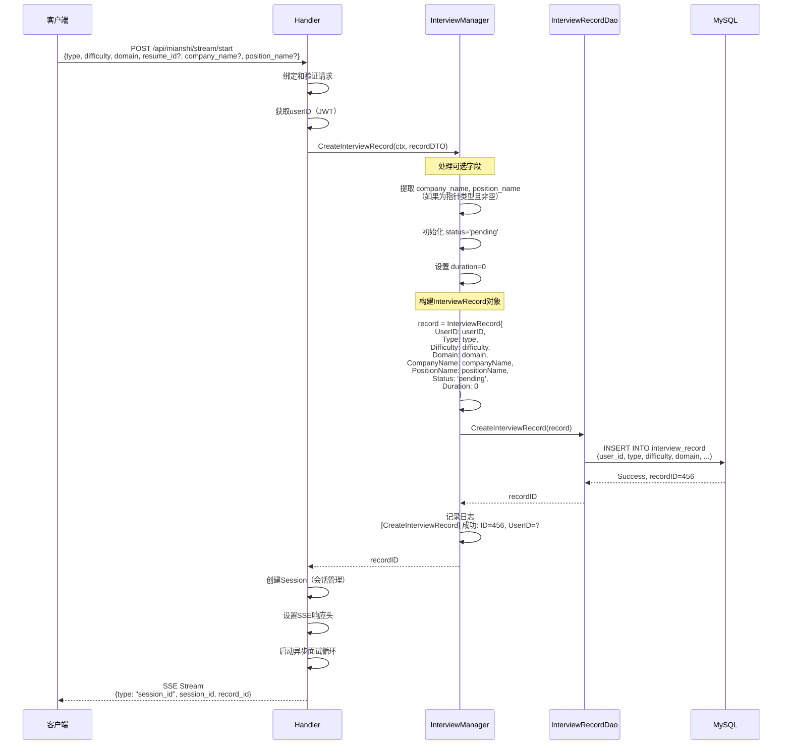

**关键点**:
1. **初始状态**: 创建时状态为 'pending'
2. **可选字段处理**: 公司名和岗位名为可选
3. **记录ID**: 创建成功后立即返回recordID用于后续关联
4. **日志记录**: 详细记录创建过程便于追踪

---

## 6. 面试进行流程

### 6.1 SSE流式面试流程

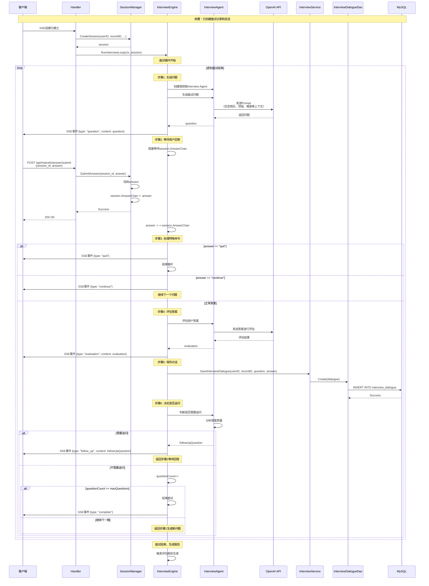

**关键点**:
1. **SSE流式通信**: 实时推送问题、评估、追问等事件
2. **会话管理**: 通过SessionManager管理多个并发面试
3. **异步处理**: 问题生成在后台异步进行
4. **智能追问**: 根据答案质量决定是否追问
5. **答案通道**: 使用channel实现异步答案接收
6. **特殊命令**: 支持quit（退出）和continue（跳过）命令

### 6.2 面试状态流转

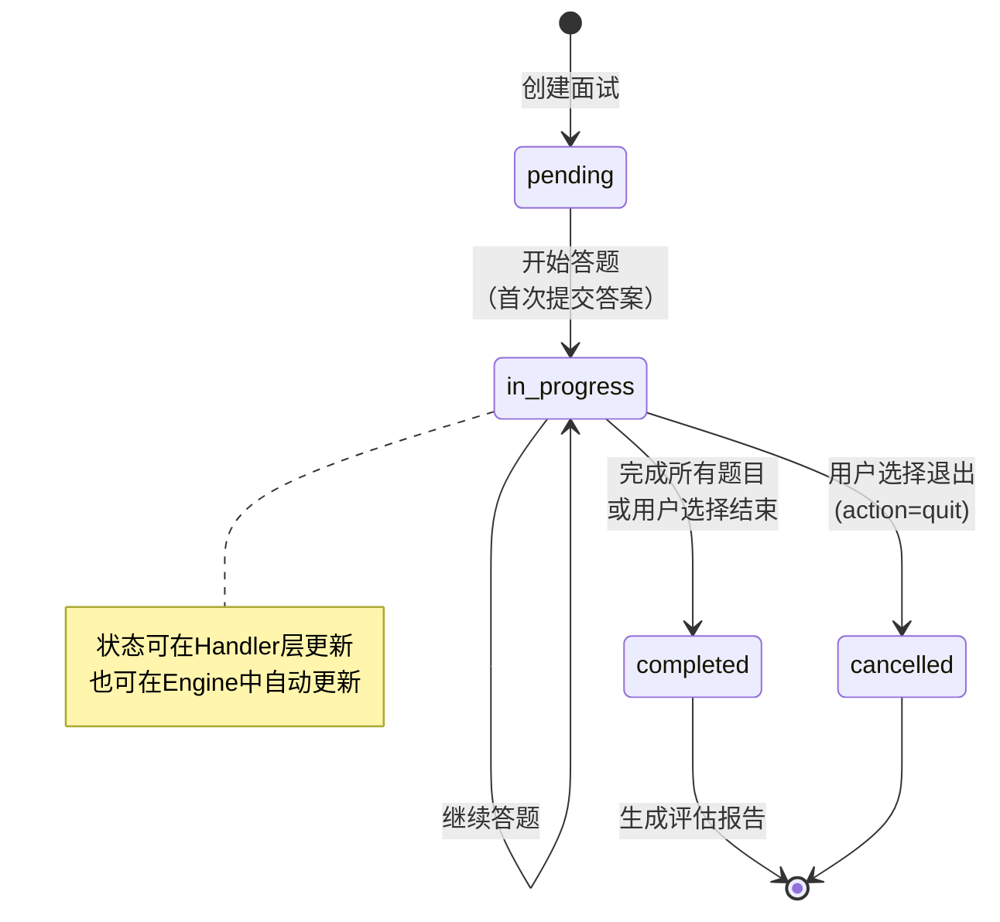

---

## 7. 押题生成流程

### 7.1 完整的押题生成流程

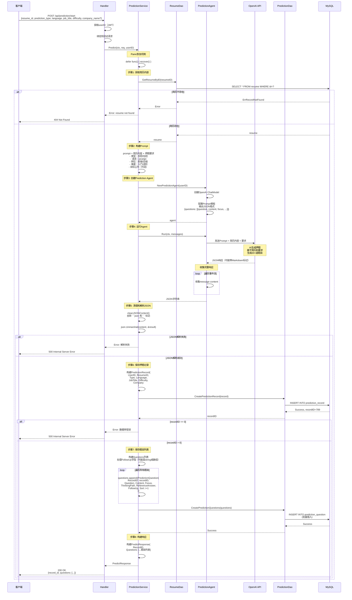

**关键点**:
1. **Panic恢复**: 使用defer+recover捕获AI调用可能的panic
2. **Prompt构建**: 包含完整简历内容和详细要求
3. **JSON清理**: AI可能返回Markdown代码块，需要清理
4. **FollowUp处理**: 追问字段可能是字符串或数组，需要灵活处理
5. **批量保存**: 题目列表使用批量插入提高性能
6. **Sort字段**: 保持题目顺序（1, 2, 3, ...）
7. **详细日志**: 每个步骤都有详细日志便于排查问题

### 7.2 押题结果结构

AI生成的JSON结构：
```json
{
  "questions": [
    {
      "question": "请介绍一下Spring Boot的自动配置原理",
      "content": "Spring Boot核心特性",
      "focus": "自动配置机制、@EnableAutoConfiguration注解",
      "thinking_path": "1. 解释自动配置的概念\n2. 说明@SpringBootApplication注解\n3. 讲解条件注解的作用",
      "reference_answer": "Spring Boot的自动配置...",
      "follow_up": "那你能说说@Conditional注解的使用场景吗？"
    },
    // ... 更多题目
  ]
}
```

---

## 8. 评估报告生成流程

### 8.1 面试评估报告生成

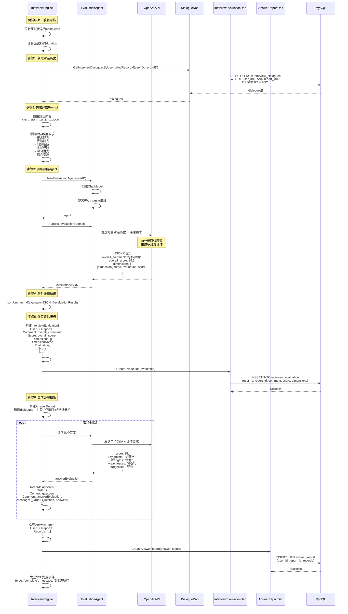

**关键点**:
1. **对话历史**: 评估基于完整的对话记录
2. **多维度评估**: 6个维度全面评价面试表现
3. **JSON存储**: Dimensions和Records使用JSON字段存储复杂结构
4. **两层报告**: 
   - InterviewEvaluation: 总体评分和维度评分
   - AnswerReport: 每个问题的详细分析
5. **AI驱动**: 完全由AI Agent分析生成，无固定规则

### 8.2 评估报告结构

**InterviewEvaluation结构**:
```json
{
  "id": 1,
  "user_id": 123,
  "report_id": 456,
  "comment": "整体表现良好，技术基础扎实...",
  "score": 85.5,
  "dimensions": [
    {
      "dimension_name": "技术能力",
      "evaluation": "对Spring框架理解深入，能够说明核心原理...",
      "score": 88.0
    },
    {
      "dimension_name": "表达能力",
      "evaluation": "回答逻辑清晰，表达流畅...",
      "score": 85.0
    },
    {
      "dimension_name": "问题理解",
      "evaluation": "能够准确理解问题要点...",
      "score": 82.0
    },
    {
      "dimension_name": "实战经验",
      "evaluation": "有实际项目经验，能够结合实例说明...",
      "score": 86.0
    },
    {
      "dimension_name": "学习潜力",
      "evaluation": "展现出良好的学习能力和技术热情...",
      "score": 87.0
    },
    {
      "dimension_name": "综合素质",
      "evaluation": "综合素质较好，具备团队协作意识...",
      "score": 84.0
    }
  ],
  "created_at": "2026-01-29T10:30:00Z",
  "updated_at": "2026-01-29T10:30:00Z"
}
```

**AnswerReport结构**:
```json
{
  "id": 1,
  "user_id": 123,
  "report_id": 456,
  "records": [
    {
      "order": 1,
      "content": "请介绍一下Spring Boot的自动配置原理",
      "comment": {
        "score": 85,
        "key_points": "自动配置、条件注解、SPI机制",
        "difficulty": "中等",
        "strengths": "能够说明核心原理和关键注解",
        "weaknesses": "对源码实现细节了解不够深入",
        "suggestion": "建议深入阅读源码，理解自动配置的实现机制",
        "know_points": "Spring Boot自动配置、@Conditional注解、spring.factories",
        "thinking": "从@EnableAutoConfiguration入手，说明自动配置的触发流程",
        "reference": "自动配置通过spring.factories加载配置类，配合@Conditional条件注解实现..."
      },
      "message": [
        {
          "order": 1,
          "question": "请介绍一下Spring Boot的自动配置原理",
          "answer": "Spring Boot的自动配置主要通过@EnableAutoConfiguration注解实现..."
        },
        {
          "order": 2,
          "question": "那你能说说@Conditional注解的使用场景吗？",
          "answer": "@Conditional注解用于根据条件决定是否创建Bean..."
        }
      ]
    },
    // ... 更多题目的详细分析
  ],
  "created_at": "2026-01-29T10:30:00Z",
  "updated_at": "2026-01-29T10:30:00Z"
}
```

---

## 9. 完整业务流程总览

### 9.1 系统核心流程交互图

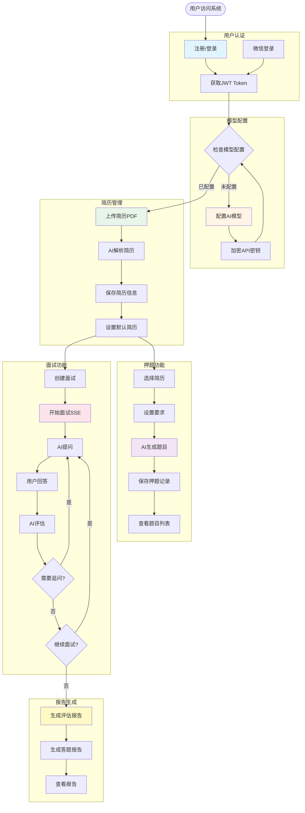

### 9.2 数据流转图

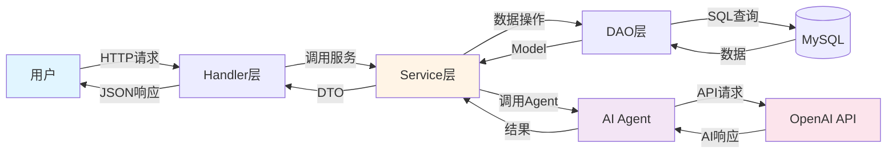

---

## 10. 关键业务规则

### 10.1 用户模型管理规则

| 规则 | 说明 | 实现位置 |
|------|------|----------|
| API密钥加密 | 所有API密钥必须加密存储 | CommonUtil.EncryptAPIKey |
| 默认模型唯一 | 一个用户只能有一个默认模型 | SetDefaultUserModel时取消其他 |
| 启用模型唯一 | 一个用户只能有一个启用模型 | SetEnabledUserModel时禁用其他 |
| 软删除 | 删除模型使用软删除标记 | Deleted=1 |

### 10.2 简历管理规则

| 规则 | 说明 | 实现位置 |
|------|------|----------|
| 文件类型限制 | 仅支持PDF格式 | Handler层验证 |
| 文件大小限制 | 最大10MB | Handler层验证 |
| 默认简历唯一 | 一个用户只能有一个默认简历 | SetDefaultResume时取消其他 |
| AI解析 | 所有简历必须通过AI解析 | ResumeAgent + PDFToTextTool |
| JSON存储 | 解析结果以JSON存储在Content字段 | ResumeService |

### 10.3 面试管理规则

| 规则 | 说明 | 实现位置 |
|------|------|----------|
| 会话隔离 | 每次面试独立的Session | SessionManager |
| SSE通信 | 面试过程使用SSE流式推送 | InterviewEngine |
| 状态流转 | pending → in_progress → completed | 状态机管理 |
| 对话记录 | 所有Q&A必须保存 | InterviewDialogue表 |
| 智能追问 | AI决定是否追问 | InterviewAgent |

### 10.4 押题管理规则

| 规则 | 说明 | 实现位置 |
|------|------|----------|
| 基于简历 | 押题必须基于用户简历 | 查询Resume表 |
| AI生成 | 所有题目由AI生成 | PredictionAgent |
| JSON输出 | AI输出必须是标准JSON格式 | Prompt模板约束 |
| 批量保存 | 题目列表批量插入 | CreatePredictionQuestions |
| 保持顺序 | Sort字段保持题目顺序 | Sort=1,2,3,... |

### 10.5 评估报告规则

| 规则 | 说明 | 实现位置 |
|------|------|----------|
| 完整对话 | 评估基于完整对话历史 | 查询所有InterviewDialogue |
| 多维度 | 必须包含6个评估维度 | Dimensions JSON字段 |
| 双层报告 | 总体评估 + 逐题分析 | InterviewEvaluation + AnswerReport |
| AI驱动 | 完全由AI分析生成 | EvaluationAgent |
| JSON存储 | 复杂结构用JSON存储 | GORM serializer:json |

---

## ❓ 问题记录

### Q1: 为什么面试使用SSE而不是WebSocket？
**我的理解**: SSE（Server-Sent Events）是单向通信，服务器推送消息到客户端，客户端通过HTTP POST提交答案。面试场景的特点：1) **服务器推送为主**：问题、评估、追问都是服务器主动推送；2) **答案提交不频繁**：用户回答通过HTTP POST即可；3) **更简单**：SSE基于HTTP，不需要协议升级，易于实现和调试；4) **更稳定**：断线重连机制简单，浏览器原生支持。WebSocket适合双向高频通信，面试场景没有这个需求。

### Q2: 为什么押题和评估都要调用AI Agent？直接存储模板不行吗？
**我的理解**: AI Agent的优势：1) **个性化**：基于用户简历生成定制题目，每个人都不同；2) **灵活性**：可以根据不同领域、难度、公司生成针对性题目；3) **质量**：AI评估更全面、更客观、更具体；4) **扩展性**：新增面试领域不需要人工编写题库。缺点是成本较高、响应时间较长。可以考虑混合模式：常见题目用模板（快速响应），深度分析用AI（高质量输出）。

### Q3: 为什么要分开保存InterviewEvaluation和AnswerReport？
**我的理解**: 两层报告服务不同目的：1) **InterviewEvaluation（总体评估）**：快速了解整体表现，6个维度打分，适合列表展示和筛选；2) **AnswerReport（答题报告）**：详细的逐题分析，包含每题的优劣势和改进建议，适合学习和提升。分开存储的好处：a) 查询效率：列表页只需加载Evaluation；b) 数据大小：AnswerReport的JSON较大，按需加载；c) 关注分离：总体评分和详细分析是不同维度的信息。

### Q4: JSON字段存储复杂数据有什么优缺点？
**我的理解**: 
**优点**：
1) **灵活性**：结构可以动态变化，无需修改表结构
2) **简化查询**：一次查询获取完整信息，无需JOIN
3) **原子性**：整体读写，无需事务处理多表
4) **便于扩展**：新增字段不影响旧数据

**缺点**：
1) **查询限制**：无法直接按JSON内部字段查询排序（MySQL 5.7+支持JSON函数但性能较差）
2) **索引限制**：JSON字段无法建立常规索引
3) **数据验证**：需要在应用层验证JSON结构
4) **存储空间**：可能占用更多空间

**使用建议**：适合不需要按内部字段查询、结构灵活多变的数据（如评估维度、答题记录）。如果需要频繁按某字段查询，应拆分为独立表。

---

## ✅ 学习检查点

- [ ] 理解用户注册登录的完整流程
- [ ] 理解微信OAuth 2.0授权流程
- [ ] 理解用户模型配置的创建和更新逻辑
- [ ] 理解简历上传和AI解析的完整过程
- [ ] 理解面试创建和SSE流式面试流程
- [ ] 理解押题生成的AI调用过程
- [ ] 理解评估报告的两层结构
- [ ] 能够画出任意核心业务的流程图
- [ ] 理解数据在各层之间的流转方式
- [ ] 理解AI Agent的集成和调用方式

---

**上一步**: [Service层概述 (README.md)](README.md)

**相关文档**:
- [数据模型详解 (models.md)](../02-data-layer/models.md)
- [API层文档 (handler-pattern.md)](../04-api-layer/handler-pattern.md)
- [AI核心架构 (agent-architecture.md)](../05-ai-core/agent-architecture.md)