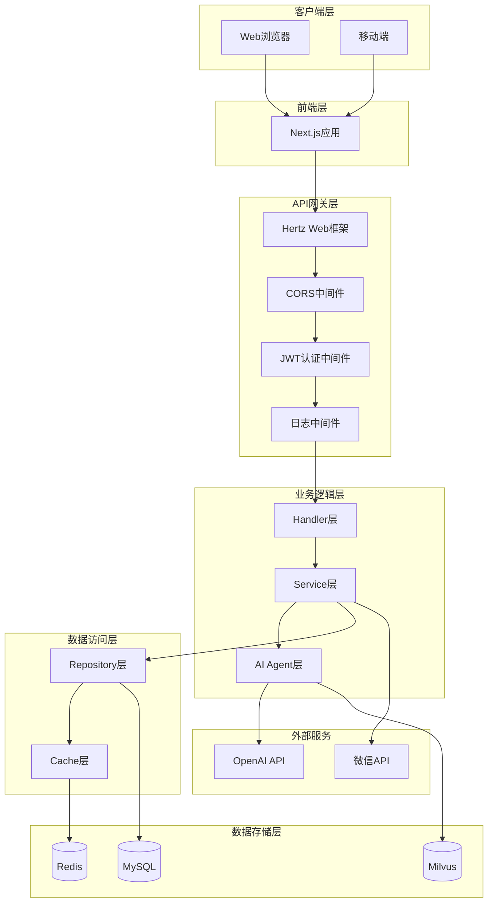
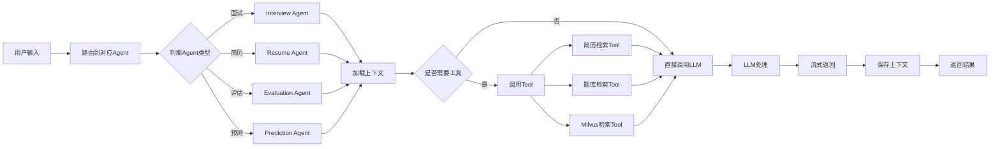
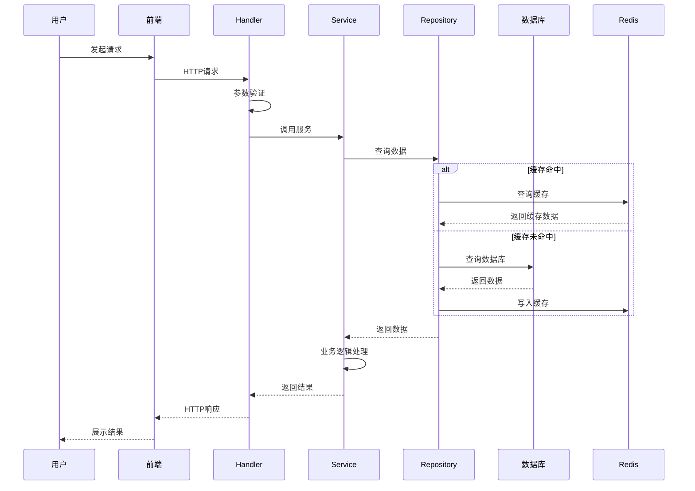
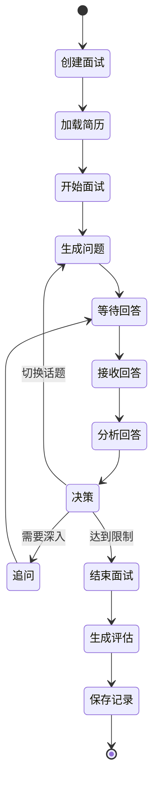
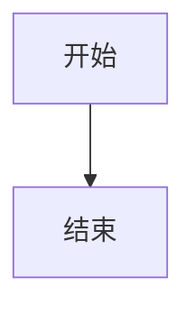

# 系统架构图

> 系统的各种架构图和流程图

## 整体架构图



**说明**: 补充你对架构图的理解_____

---

## AI工作流图



**说明**: _____

---

## 数据流图



**说明**: _____

---

## 面试流程图



**说明**: _____

---

## 数据库ER图

```
┌─────────────┐
│    users    │
├─────────────┤
│ id (PK)     │
│ username    │
│ email       │
│ password    │
│ created_at  │
│ updated_at  │
└──────┬──────┘
       │ 1
       │
       │ N
┌──────┴──────────┐         ┌─────────────────┐
│    resumes      │         │ interview_records│
├─────────────────┤         ├──────────────────┤
│ id (PK)         │         │ id (PK)          │
│ user_id (FK)    │         │ user_id (FK)     │
│ title           │         │ type             │
│ content         │         │ status           │
│ file_url        │         │ start_time       │
│ created_at      │         │ end_time         │
└────────┬────────┘         └────────┬─────────┘
         │ 1                         │ 1
         │                           │
         │ N                         │ N
┌────────┴─────────┐         ┌───────┴──────────────┐
│   predictions    │         │ interview_dialogues  │
├──────────────────┤         ├──────────────────────┤
│ id (PK)          │         │ id (PK)              │
│ resume_id (FK)   │         │ interview_id (FK)    │
│ category         │         │ role                 │
│ questions        │         │ content              │
│ created_at       │         │ sequence             │
└──────────────────┘         └──────────────────────┘
                                     
                             ┌──────────────────────┐
                             │ interview_evaluations│
                             ├──────────────────────┤
                             │ id (PK)              │
                             │ interview_id (FK)    │
                             │ total_score          │
                             │ feedback             │
                             │ created_at           │
                             └──────────────────────┘
```

**说明**: _____

---

## 部署架构图

```
┌─────────────────────────────────────────┐
│            Load Balancer                 │
└──────────────┬──────────────────────────┘
               │
       ┌───────┴────────┐
       │                │
┌──────▼──────┐  ┌──────▼──────┐
│   Nginx 1   │  │   Nginx 2   │
└──────┬──────┘  └──────┬──────┘
       │                │
       └───────┬────────┘
               │
       ┌───────┴────────┐
       │                │
┌──────▼──────┐  ┌──────▼──────┐
│  Backend 1  │  │  Backend 2  │
│  (Hertz)    │  │  (Hertz)    │
└──────┬──────┘  └──────┬──────┘
       │                │
       └───────┬────────┘
               │
       ┌───────┴────────┬────────┐
       │                │        │
┌──────▼──────┐  ┌──────▼──┐  ┌─▼────────┐
│   MySQL     │  │  Redis  │  │  Milvus  │
│   Master    │  │ Cluster │  │          │
└──────┬──────┘  └─────────┘  └──────────┘
       │
┌──────▼──────┐
│   MySQL     │
│   Slave     │
└─────────────┘
```

**说明**: _____

---

## 你的架构图

请在这里补充你自己画的架构图和理解：

### 我理解的系统架构

```
在这里画出你的理解
```

### 我理解的数据流

```
在这里画出你的理解
```

### 我理解的AI处理流程

```
在这里画出你的理解
```

---

## 工具推荐

### 画图工具
- [Mermaid](https://mermaid.js.org/) - 代码画流程图
- [Draw.io](https://www.drawio.com/) - 在线画图工具
- [PlantUML](https://plantuml.com/) - UML图工具
- [Excalidraw](https://excalidraw.com/) - 手绘风格画图

### 使用Mermaid

在Markdown中直接写：

````markdown

````

---

**返回**: [Wiki首页](../README.md)
